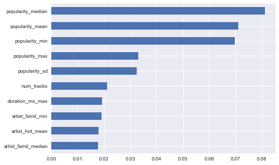
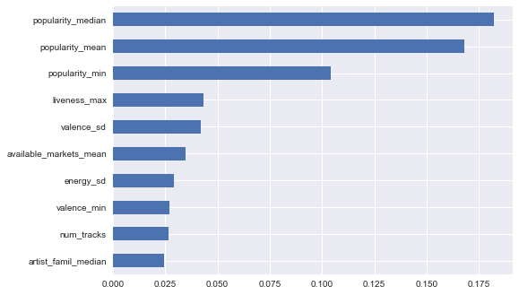

## Contents
{:.no_toc}
*  
{: toc}


```python
import numpy as np
import pandas as pd
import matplotlib
import matplotlib.pyplot as plt
import pickle
import seaborn as sns
import statsmodels.api as sm
from sklearn.linear_model import LogisticRegressionCV
from sklearn.linear_model import LogisticRegression
import sklearn.metrics as metrics
from sklearn.tree import DecisionTreeClassifier, DecisionTreeClassifier
from matplotlib.ticker import FuncFormatter
from sklearn.model_selection import cross_val_score
import collections
from sklearn.model_selection import GridSearchCV
from sklearn.ensemble import RandomForestClassifier
from sklearn.ensemble import AdaBoostClassifier
import sklearn.tree as tree
import collections
%matplotlib inline
```


## Data Imputation and Dummy Creation


```python
'''Read in our cleaned, aggregated data'''
plt.style.use('seaborn')
with open('aggregate_data.p', 'rb') as f:
    data = pickle.load(f)

#Impute missings with mean by category. Missings occur because the Million Songs Database only goes up until 2010.
category_means = data.groupby('category').mean()
tmp = data.join(category_means, rsuffix = '_category_mean', on = 'category')
means = tmp[[x+'_category_mean' for x in data.columns if x not in ['category', 'featured','num_tracks','num_followers']]]
means.columns = [x.split('_category_mean')[0] for x in means.columns]
#fill with mean by category and replace with overall mean if no mean by category
data = data.fillna(means)
data = data.fillna(data.mean())


def create_categorical_vars(data):
    categorical = ['category']
    dummies = {}
    for var in categorical:
        dummies[var] = pd.get_dummies(data[var], prefix = var)
        cols_to_keep = dummies[var].columns[0:len(dummies[var].columns)-1]
        data = data.join(dummies[var][cols_to_keep])
        data = data.drop(var, 1)
    return data
raw_data = data
data = create_categorical_vars(data)


#split into train / test to avoid cheating
np.random.seed(1234)
train_pct = .5
msk = np.random.uniform(0,1,len(data)) < train_pct
train = data.loc[msk, :]
test = data.loc[~msk, :]
```


```python
'''We take a peek at our new training dataset'''
train.head()
```


<div>
<style>
    .dataframe thead tr:only-child th {
        text-align: right;
    }

    .dataframe thead th {
        text-align: left;
    }

    .dataframe tbody tr th {
        vertical-align: top;
    }
</style>
<table border="1" class="dataframe">
  <thead>
    <tr style="text-align: right;">
      <th></th>
      <th>acousticness_max</th>
      <th>acousticness_mean</th>
      <th>acousticness_median</th>
      <th>acousticness_min</th>
      <th>acousticness_sd</th>
      <th>danceability_max</th>
      <th>danceability_mean</th>
      <th>danceability_median</th>
      <th>danceability_min</th>
      <th>danceability_sd</th>
      <th>...</th>
      <th>category_pop</th>
      <th>category_popculture</th>
      <th>category_punk</th>
      <th>category_reggae</th>
      <th>category_rock</th>
      <th>category_romance</th>
      <th>category_sleep</th>
      <th>category_soul</th>
      <th>category_toplists</th>
      <th>category_travel</th>
    </tr>
  </thead>
  <tbody>
    <tr>
      <th>37i9dQZF1DWSBRKlyNxSuy</th>
      <td>0.985</td>
      <td>0.904500</td>
      <td>0.9440</td>
      <td>0.623000</td>
      <td>0.083575</td>
      <td>0.540</td>
      <td>0.442917</td>
      <td>0.4635</td>
      <td>0.2890</td>
      <td>0.065845</td>
      <td>...</td>
      <td>0</td>
      <td>0</td>
      <td>0</td>
      <td>0</td>
      <td>0</td>
      <td>0</td>
      <td>0</td>
      <td>0</td>
      <td>0</td>
      <td>0</td>
    </tr>
    <tr>
      <th>37i9dQZF1DWSIcimvN18p3</th>
      <td>0.994</td>
      <td>0.649742</td>
      <td>0.7090</td>
      <td>0.013200</td>
      <td>0.277198</td>
      <td>0.813</td>
      <td>0.537625</td>
      <td>0.5260</td>
      <td>0.2190</td>
      <td>0.133520</td>
      <td>...</td>
      <td>0</td>
      <td>0</td>
      <td>0</td>
      <td>0</td>
      <td>0</td>
      <td>0</td>
      <td>0</td>
      <td>0</td>
      <td>0</td>
      <td>0</td>
    </tr>
    <tr>
      <th>37i9dQZF1DWSNNoRF9meHq</th>
      <td>0.989</td>
      <td>0.916120</td>
      <td>0.9340</td>
      <td>0.643000</td>
      <td>0.069801</td>
      <td>0.237</td>
      <td>0.117402</td>
      <td>0.1115</td>
      <td>0.0611</td>
      <td>0.042378</td>
      <td>...</td>
      <td>0</td>
      <td>0</td>
      <td>0</td>
      <td>0</td>
      <td>0</td>
      <td>0</td>
      <td>0</td>
      <td>0</td>
      <td>0</td>
      <td>0</td>
    </tr>
    <tr>
      <th>37i9dQZF1DWSNmwgf7Nv11</th>
      <td>0.979</td>
      <td>0.490855</td>
      <td>0.4705</td>
      <td>0.000552</td>
      <td>0.306968</td>
      <td>0.831</td>
      <td>0.527132</td>
      <td>0.5335</td>
      <td>0.1990</td>
      <td>0.138828</td>
      <td>...</td>
      <td>0</td>
      <td>0</td>
      <td>0</td>
      <td>0</td>
      <td>0</td>
      <td>0</td>
      <td>0</td>
      <td>0</td>
      <td>0</td>
      <td>0</td>
    </tr>
    <tr>
      <th>37i9dQZF1DWSRoT7QRAibZ</th>
      <td>0.937</td>
      <td>0.736114</td>
      <td>0.8045</td>
      <td>0.055500</td>
      <td>0.207173</td>
      <td>0.897</td>
      <td>0.560451</td>
      <td>0.5460</td>
      <td>0.3380</td>
      <td>0.119142</td>
      <td>...</td>
      <td>0</td>
      <td>0</td>
      <td>0</td>
      <td>0</td>
      <td>0</td>
      <td>0</td>
      <td>0</td>
      <td>0</td>
      <td>0</td>
      <td>0</td>
    </tr>
  </tbody>
</table>
<p>5 rows × 115 columns</p>
</div>


## Create Classification Quintiles


```python
'''We split our dependent var into quantiles for classification. We chose to use quintiles.'''
data['num_followers_quantile'] = pd.qcut(data['num_followers'], 5, labels=False)
quantiles = data['num_followers_quantile']

y_train = train['num_followers'].astype(float)
y_test = test['num_followers'].astype(float)


y_train_class = pd.concat([y_train, quantiles], axis=1, join_axes=[y_train.index]).drop('num_followers', axis = 1).values.ravel()
y_test_class = pd.concat([y_test, quantiles], axis=1, join_axes=[y_test.index]).drop('num_followers', axis = 1).values.ravel()

y_train_class_by_cat = raw_data.groupby('category')['num_followers'].apply(lambda x: pd.qcut(x, 3, labels = False)).loc[msk]
y_test_class_by_cat = raw_data.groupby('category')['num_followers'].apply(lambda x: pd.qcut(x, 3, labels = False)).loc[~msk]

```


## Standardize


```python
'''Standardize numeric features'''
to_x_train = train[[x for x in train.columns if x != 'num_followers']]
to_x_test = test[[x for x in test.columns if x != 'num_followers']]

#Define continuous vars
continuous_variables = [x for x in to_x_train.columns if 'category' not in x and x != 'available_markets_max' and x != 'featured']
non_continuous_variables = [x for x in to_x_train.columns if 'category' in x]

#standardize data
def standardize_data(data, train):
        return (data - train.mean()) / train.std()


x_train_cont = standardize_data(to_x_train[continuous_variables], to_x_train[continuous_variables])
x_test_cont = standardize_data(to_x_test[continuous_variables], to_x_train[continuous_variables])

#merge back on non-continuous variables
x_train_std = x_train_cont.join(to_x_train[non_continuous_variables])
x_test_std = x_test_cont.join(to_x_test[non_continuous_variables])

x_train_std2 = x_train_std.join(to_x_train['available_markets_max'])
x_test_std2 = x_test_std.join(to_x_test['available_markets_max'])

x_train_std3 = x_train_std2.join(to_x_train['featured'])
x_test_std3 = x_test_std2.join(to_x_test['featured'])

x_train_class = sm.tools.add_constant(x_train_std3, has_constant = 'add')
x_test_class = sm.tools.add_constant(x_test_std3, has_constant = 'add')
```


```python
'''calculate classification accuracy'''
def calculate_cr(classifications, y):
    correct = classifications == y
    cr = correct.sum()/len(correct)
    return cr
```


## Baseline Model


```python
'''Begin with logistic models as baseline
Multinomial Logistic'''
logistic_regression_mn = LogisticRegressionCV(Cs=10, multi_class='multinomial').fit(x_train_class, y_train_class)
logistic_classifications_train_mn = logistic_regression_mn.predict(x_train_class)
logistic_classifications_test_mn = logistic_regression_mn.predict(x_test_class)

print("Multinomial Logistic Regression")
print("\tTrain CR:", str(calculate_cr(logistic_classifications_train_mn, y_train_class)))
print("\tTest CR:", str(calculate_cr(logistic_classifications_test_mn, y_test_class)))

#OvR Logistic Reg
logistic_regression_ovr = LogisticRegressionCV(Cs=10, multi_class='ovr').fit(x_train_class, y_train_class)
logistic_classifications_train_ovr = logistic_regression_ovr.predict(x_train_class)
logistic_classifications_test_ovr = logistic_regression_ovr.predict(x_test_class)

print("OvR Logistic Regression")
print("\tTrain CR:", str(calculate_cr(logistic_classifications_train_ovr, y_train_class)))
print("\tTest CR:", str(calculate_cr(logistic_classifications_test_ovr, y_test_class)))

```


    Multinomial Logistic Regression
    	Train CR: 0.706586826347
    	Test CR: 0.355555555556
    OvR Logistic Regression
    	Train CR: 0.494011976048
    	Test CR: 0.363888888889


## Additional Models - Across Categories
### Decision Tree


```python
'''Decision Tree with CV to pick max depth'''
param_grid = {'max_depth' : range(1,30)}
clf = GridSearchCV(DecisionTreeClassifier(), param_grid = param_grid, cv = 5, refit = True)
clf.fit(x_train_class, y_train_class)
print('Cross-Validated Max Depth: {x}'.format(x = clf.best_params_['max_depth']))
print('Avg Cross-Validation Accuracy at Max: {x}%'.format(x = str(clf.best_score_*100)[0:5]))
print('Test Accuracy: {x}%'.format(x = str(clf.score(x_test_class,y_test_class)*100)[0:5]))

```


    Cross-Validated Max Depth: 4
    Avg Cross-Validation Accuracy at Max: 33.53%
    Test Accuracy: 34.72%


### Random Forest


```python
'''Random Forest with CV to pick max depth and Number of Trees'''
param_grid = {'n_estimators' : [2**i for i in [1,2,3,4,5,6,7,8, 9, 10]],
              'max_depth' : [1,2,3,4,5,6,7,8]}
clf = GridSearchCV(RandomForestClassifier(), param_grid = param_grid, cv = 5, refit = True, n_jobs = 4)
clf.fit(x_train_class, y_train_class)
print('Cross-Validated Max Depth: {x}'.format(x = clf.best_params_['max_depth']))
print('Cross-Validated Num Trees: {x}'.format(x = clf.best_params_['n_estimators']))
print('Avg Cross-Validation Accuracy at Max: {x}%'.format(x = str(clf.best_score_*100)[0:5]))
print('Test Accuracy: {x}%'.format(x = str(clf.score(x_test_class,y_test_class)*100)[0:5]))
```


    Cross-Validated Max Depth: 6
    Cross-Validated Num Trees: 512
    Avg Cross-Validation Accuracy at Max: 41.01%
    Test Accuracy: 37.22%


```python
''' Top 10 most important features based on RF (as expected, popularity is important)'''
feature_importance = pd.Series(clf.best_estimator_.feature_importances_, index = x_train_class.columns)
feature_importance.sort_values(ascending = False).head(10).sort_values(ascending = True).plot('barh')
```


    <matplotlib.axes._subplots.AxesSubplot at 0x28e26458470>





### AdaBoosted Decision Trees


```python
'''AdaBoost with CV to pick max depth and number of trees'''
learning_rate = .05

param_grid = {'n_estimators' : [2**i for i in [1,2,3,4,5,6,7,8]],
              'base_estimator__max_depth' : [1,2,3,4,5,6,7,8, 9, 10, 11, 12]}
clf = GridSearchCV(AdaBoostClassifier(DecisionTreeClassifier(), learning_rate = learning_rate), param_grid = param_grid, cv = 5, refit = True, n_jobs = 4)
clf.fit(x_train_class, y_train_class)
print('Cross-Validated Max Depth: {x}'.format(x = clf.best_params_['base_estimator__max_depth']))
print('Cross-Validated Num Trees: {x}'.format(x = clf.best_params_['n_estimators']))
print('Avg Cross-Validation Accuracy at Max: {x}%'.format(x = str(clf.best_score_*100)[0:5]))
print('Test Accuracy: {x}%'.format(x = str(clf.score(x_test_class,y_test_class)*100)[0:5]))
```


    Cross-Validated Max Depth: 2
    Cross-Validated Num Trees: 64
    Avg Cross-Validation Accuracy at Max: 42.81%
    Test Accuracy: 35.83%


```python
'''This shows similar results for popularity being important'''
feature_importance = pd.Series(clf.best_estimator_.feature_importances_, index = x_train_class.columns)
feature_importance.sort_values(ascending = False).head(10).sort_values(ascending = True).plot('barh')

```


    <matplotlib.axes._subplots.AxesSubplot at 0x16d875e5438>





## Classification Within Categories
### Decision Tree


```python
'''Decision Tree with CV to pick max depth'''
param_grid = {'max_depth' : range(1,30)}
clf = GridSearchCV(DecisionTreeClassifier(), param_grid = param_grid, cv = 5, refit = True)
clf.fit(x_train_class, y_train_class_by_cat)
print('Cross-Validated Max Depth: {x}'.format(x = clf.best_params_['max_depth']))
print('Avg Cross-Validation Accuracy at Max: {x}%'.format(x = str(clf.best_score_*100)[0:5]))
print('Test Accuracy: {x}%'.format(x = str(clf.score(x_test_class,y_test_class_by_cat)*100)[0:5]))
```


    Cross-Validated Max Depth: 2
    Avg Cross-Validation Accuracy at Max: 46.10%
    Test Accuracy: 46.94%


### Random Forest


```python
'''Random Forest with CV to pick max depth and number of trees'''
param_grid = {'n_estimators' : [2**i for i in [1,2,3,4,5,6,7,8, 9, 10]],
              'max_depth' : [1,2,3,4,5,6,7,8]}
clf = GridSearchCV(RandomForestClassifier(), param_grid = param_grid, cv = 5, refit = True, n_jobs = 4)
clf.fit(x_train_class, y_train_class_by_cat)
print('Cross-Validated Max Depth: {x}'.format(x = clf.best_params_['max_depth']))
print('Cross-Validated Num Trees: {x}'.format(x = clf.best_params_['n_estimators']))
print('Avg Cross-Validation Accuracy at Max: {x}%'.format(x = str(clf.best_score_*100)[0:5]))
print('Test Accuracy: {x}%'.format(x = str(clf.score(x_test_class,y_test_class_by_cat)*100)[0:5]))
```


    Cross-Validated Max Depth: 4
    Cross-Validated Num Trees: 32
    Avg Cross-Validation Accuracy at Max: 48.20%
    Test Accuracy: 45.27%


### AdaBoosted Decision Tree


```python
'''AdaBoost with CV to pick max depth and number of trees'''
learning_rate = .05
param_grid = {'n_estimators' : [2**i for i in [1,2,3,4,5,6,7,8]],
              'base_estimator__max_depth' : [1,2,3,4,5,6,7,8, 9, 10, 11, 12]}
clf = GridSearchCV(AdaBoostClassifier(DecisionTreeClassifier(), learning_rate = learning_rate), param_grid = param_grid, cv = 5, refit = True, n_jobs = 4)
clf.fit(x_train_class, y_train_class_by_cat)
print('Cross-Validated Max Depth: {x}'.format(x = clf.best_params_['base_estimator__max_depth']))
print('Cross-Validated Num Trees: {x}'.format(x = clf.best_params_['n_estimators']))
print('Avg Cross-Validation Accuracy at Max: {x}%'.format(x = str(clf.best_score_*100)[0:5]))
print('Test Accuracy: {x}%'.format(x = str(clf.score(x_test_class,y_test_class_by_cat)*100)[0:5]))
```


    Cross-Validated Max Depth: 1
    Cross-Validated Num Trees: 64
    Avg Cross-Validation Accuracy at Max: 48.20%
    Test Accuracy: 47.77%

