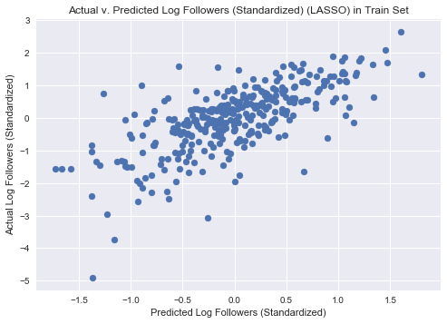
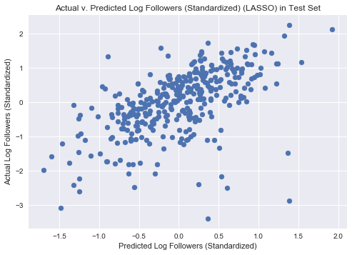

## Contents
{:.no_toc}
*  
{: toc}


```python
import numpy as np
import pandas as pd
import matplotlib
import matplotlib.pyplot as plt
import datetime
from datetime import date
from sklearn.metrics import r2_score
import statsmodels.api as sm
from statsmodels.api import OLS
from sklearn.linear_model import RidgeCV
from sklearn.linear_model import LassoCV
from sklearn.linear_model import LinearRegression
import sklearn.metrics as metrics
from sklearn.model_selection import cross_val_score
import pickle
import sys
import spotipy
import spotipy.util as util
from spotipy.oauth2 import SpotifyOAuth
import os
import seaborn as sns
plt.style.use('seaborn')
import collections
%matplotlib inline
```


```python
#Read in our cleaned, aggregated data
plt.style.use('seaborn')
with open('aggregate_data.p', 'rb') as f:
    data = pickle.load(f)

#impute missings with mean by category
category_means = data.groupby('category').mean()
tmp = data.join(category_means, rsuffix = '_category_mean', on = 'category')
means = tmp[[x+'_category_mean' for x in data.columns if x not in ['category', 'featured','num_tracks','num_followers']]]
means.columns = [x.split('_category_mean')[0] for x in means.columns]
#fill with mean by category and replace with overall mean if no mean by category
data = data.fillna(means)
data = data.fillna(data.mean())


def create_categorical_vars(data):
    categorical = ['category']
    dummies = {}
    for var in categorical:
        dummies[var] = pd.get_dummies(data[var], prefix = var)
        cols_to_keep = dummies[var].columns[0:len(dummies[var].columns)-1]
        data = data.join(dummies[var][cols_to_keep])
        data = data.drop(var, 1)
    return data
raw_data = data
data = create_categorical_vars(data)


#split into train / test to avoid cheating
np.random.seed(1234)
train_pct = .5
msk = np.random.uniform(0,1,len(data)) < train_pct
train = data.loc[msk, :]
test = data.loc[~msk, :]
```


```python
train.head()
```


<div>
<style>
    .dataframe thead tr:only-child th {
        text-align: right;
    }

    .dataframe thead th {
        text-align: left;
    }

    .dataframe tbody tr th {
        vertical-align: top;
    }
</style>
<table border="1" class="dataframe">
  <thead>
    <tr style="text-align: right;">
      <th></th>
      <th>acousticness_max</th>
      <th>acousticness_mean</th>
      <th>acousticness_median</th>
      <th>acousticness_min</th>
      <th>acousticness_sd</th>
      <th>danceability_max</th>
      <th>danceability_mean</th>
      <th>danceability_median</th>
      <th>danceability_min</th>
      <th>danceability_sd</th>
      <th>...</th>
      <th>category_pop</th>
      <th>category_popculture</th>
      <th>category_punk</th>
      <th>category_reggae</th>
      <th>category_rock</th>
      <th>category_romance</th>
      <th>category_sleep</th>
      <th>category_soul</th>
      <th>category_toplists</th>
      <th>category_travel</th>
    </tr>
  </thead>
  <tbody>
    <tr>
      <th>37i9dQZF1DWSBRKlyNxSuy</th>
      <td>0.985</td>
      <td>0.904500</td>
      <td>0.9440</td>
      <td>0.623000</td>
      <td>0.083575</td>
      <td>0.540</td>
      <td>0.442917</td>
      <td>0.4635</td>
      <td>0.2890</td>
      <td>0.065845</td>
      <td>...</td>
      <td>0</td>
      <td>0</td>
      <td>0</td>
      <td>0</td>
      <td>0</td>
      <td>0</td>
      <td>0</td>
      <td>0</td>
      <td>0</td>
      <td>0</td>
    </tr>
    <tr>
      <th>37i9dQZF1DWSIcimvN18p3</th>
      <td>0.994</td>
      <td>0.649742</td>
      <td>0.7090</td>
      <td>0.013200</td>
      <td>0.277198</td>
      <td>0.813</td>
      <td>0.537625</td>
      <td>0.5260</td>
      <td>0.2190</td>
      <td>0.133520</td>
      <td>...</td>
      <td>0</td>
      <td>0</td>
      <td>0</td>
      <td>0</td>
      <td>0</td>
      <td>0</td>
      <td>0</td>
      <td>0</td>
      <td>0</td>
      <td>0</td>
    </tr>
    <tr>
      <th>37i9dQZF1DWSNNoRF9meHq</th>
      <td>0.989</td>
      <td>0.916120</td>
      <td>0.9340</td>
      <td>0.643000</td>
      <td>0.069801</td>
      <td>0.237</td>
      <td>0.117402</td>
      <td>0.1115</td>
      <td>0.0611</td>
      <td>0.042378</td>
      <td>...</td>
      <td>0</td>
      <td>0</td>
      <td>0</td>
      <td>0</td>
      <td>0</td>
      <td>0</td>
      <td>0</td>
      <td>0</td>
      <td>0</td>
      <td>0</td>
    </tr>
    <tr>
      <th>37i9dQZF1DWSNmwgf7Nv11</th>
      <td>0.979</td>
      <td>0.490855</td>
      <td>0.4705</td>
      <td>0.000552</td>
      <td>0.306968</td>
      <td>0.831</td>
      <td>0.527132</td>
      <td>0.5335</td>
      <td>0.1990</td>
      <td>0.138828</td>
      <td>...</td>
      <td>0</td>
      <td>0</td>
      <td>0</td>
      <td>0</td>
      <td>0</td>
      <td>0</td>
      <td>0</td>
      <td>0</td>
      <td>0</td>
      <td>0</td>
    </tr>
    <tr>
      <th>37i9dQZF1DWSRoT7QRAibZ</th>
      <td>0.937</td>
      <td>0.736114</td>
      <td>0.8045</td>
      <td>0.055500</td>
      <td>0.207173</td>
      <td>0.897</td>
      <td>0.560451</td>
      <td>0.5460</td>
      <td>0.3380</td>
      <td>0.119142</td>
      <td>...</td>
      <td>0</td>
      <td>0</td>
      <td>0</td>
      <td>0</td>
      <td>0</td>
      <td>0</td>
      <td>0</td>
      <td>0</td>
      <td>0</td>
      <td>0</td>
    </tr>
  </tbody>
</table>
<p>5 rows × 115 columns</p>
</div>


```python
#Take the log of number of followers because of EDA that shows how quickly it increases
to_y_train = np.log(train['num_followers'].astype(float))
to_y_test = np.log(test['num_followers'].astype(float))
to_x_train = train[[x for x in train.columns if x != 'num_followers']]
to_x_test = test[[x for x in test.columns if x != 'num_followers']]
```


```python
#Define continuous vars
continuous_variables = [x for x in to_x_train.columns if 'category' not in x and x != 'available_markets_max' and x != 'featured']
non_continuous_variables = [x for x in to_x_train.columns if 'category' in x]

#standardize data
def standardize_data(data, train):
        return (data - train.mean()) / train.std()


x_train_cont = standardize_data(to_x_train[continuous_variables], to_x_train[continuous_variables])
x_test_cont = standardize_data(to_x_test[continuous_variables], to_x_train[continuous_variables])

#merge back on non-continuous variables and add constant
x_train_std = x_train_cont.join(to_x_train[non_continuous_variables])
x_test_std = x_test_cont.join(to_x_test[non_continuous_variables])

x_train_std2 = x_train_std.join(to_x_train['available_markets_max'])
x_test_std2 = x_test_std.join(to_x_test['available_markets_max'])

x_train_std3 = x_train_std2.join(to_x_train['featured'])
x_test_std3 = x_test_std2.join(to_x_test['featured'])


y_train = standardize_data(to_y_train, to_y_train).astype(float)
y_test = standardize_data(to_y_test, to_y_train).astype(float)

x_train_const = sm.tools.add_constant(x_train_std3, has_constant = 'add')
x_test_const = sm.tools.add_constant(x_test_std3, has_constant = 'add')
```


```python
#Here we drop things with colinearity as well as some things
#that don't make sense, e.g. the mean of the time signature of songs on the playlist
to_drop = ['acousticness_max',  'acousticness_median', 'acousticness_min', 'danceability_max',  'danceability_median', 'danceability_min', 
'duration_ms_max',  'duration_ms_median', 'duration_ms_min', 'energy_max', 'energy_median', 'energy_min', 
'instrumentalness_max', 'instrumentalness_median', 'instrumentalness_min', 'liveness_max',  'liveness_median', 
'liveness_min', 'loudness_max', 'loudness_median', 'loudness_min','mode_mean', 'mode_median', 
'available_markets_max','available_markets_median', 'available_markets_min', 'popularity_median', 
'popularity_min', 'speechiness_max', 'speechiness_median', 'speechiness_min', 'tempo_max','tempo_median', 
'tempo_min', 'time_signature_mode', 'valence_max', 'valence_median', 'valence_min', 'artist_famil_max', 
'artist_famil_median', 'artist_famil_min', 'artist_hot_max', 
 'artist_hot_median', 'artist_hot_min', 
'song_hot_max', 'song_hot_median', 'song_hot_min']

x_train = x_train_const.drop(to_drop, axis=1)
x_test = x_test_const.drop(to_drop, axis=1)

```


```python
#Baseline model: simple OLS
regression = OLS(y_train, x_train).fit()
ols_train_preds = regression.predict(x_train)
ols_test_preds = regression.predict(x_test)
print('Train R^2: {rsq}'.format(rsq = regression.rsquared))
cv = cross_val_score(LinearRegression(fit_intercept = False), x_train, y_train, cv = 6)
print('Cross Val Score: {rsq}'.format(rsq = np.mean(cv)))
print('Train BIC: {bic}'.format(bic = regression.bic))
print('Test R^2: ', r2_score(y_test, ols_test_preds))
```


    Train R^2: 0.5621439417922931
    Cross Val Score: 0.27461864710575923
    Train BIC: 1066.1680987155785
    Test R^2:  0.303403795346


## LASSO


```python
#LASSO
lasso_model = LassoCV(alphas = [10**i for i in (-5,-4,-3,-2,-1,0,1,2,3,4,5)], fit_intercept = False, tol = 0.1)
lasso_fitted = lasso_model.fit(x_train, y_train)
print("Train R2", lasso_fitted.score(x_train, y_train))
cv = cross_val_score(LassoCV(alphas = [10**i for i in (-5,-4,-3,-2,-1,0,1,2,3,4,5)], fit_intercept = False, tol = .1), x_train, y_train, cv = 6)
print('Cross Val Score: {rsq}'.format(rsq = np.mean(cv)))
print("Test R2", lasso_fitted.score(x_test, y_test))

#plot predicted v actual values in train
plt.scatter(lasso_fitted.predict(x_train), y_train)
plt.title('Actual v. Predicted Log Followers (Standardized) (LASSO) in Train Set')
plt.xlabel('Predicted Log Followers (Standardized)')
plt.ylabel('Actual Log Followers (Standardized)')
plt.show()
#plot predicted v actual values in test
plt.scatter(lasso_fitted.predict(x_test), y_test)
plt.title('Actual v. Predicted Log Followers (Standardized) (LASSO) in Test Set')
plt.xlabel('Predicted Log Followers (Standardized)')
plt.ylabel('Actual Log Followers (Standardized)')
plt.show()
```


    Train R2 0.490103361898
    Cross Val Score: 0.34374150263617853
    Test R2 0.324486785413








## Ridge


```python
#Ridge
ridge_model = RidgeCV(alphas = [10**i for i in (-5,-4,-3,-2,-1,0,1,2,3,4,5)], fit_intercept = False)
ridge_fitted = ridge_model.fit(x_train, y_train)
print("Train R2", ridge_fitted.score(x_train, y_train))
cv = cross_val_score(RidgeCV(alphas = [10**i for i in (-5,-4,-3,-2,-1,0,1,2,3,4,5)], fit_intercept = False), x_train, y_train, cv = 6)
print('Cross Val Score: {rsq}'.format(rsq = np.mean(cv)))
print("Test R2", ridge_fitted.score(x_test, y_test))
```


    Train R2 0.558018998229
    Cross Val Score: 0.2834830375944262
    Test R2 0.31182299033


```python
'''
Now we want to use our LASSO regression model to predict which of our random playists (see data retrieval notebook for how
these were generated) is the theoretical "best" playlist
'''

with open('candidate_playlists_20171205.p', 'rb') as f:
    candidate_playlists = pickle.load(f)
    candidate_playlists[[x for x in candidate_playlists if x!='category']] = candidate_playlists[[x for x in candidate_playlists if x!='category']].astype(float)
    
with open('candidate_playlists_to_songs_20171205.p', 'rb') as f:
    playlist_id_to_songs = pickle.load(f)

category_means = candidate_playlists.groupby('category').mean()
tmp = candidate_playlists.join(category_means, rsuffix = '_category_mean', on = 'category')
means = tmp[[x+'_category_mean' for x in candidate_playlists.columns if x not in ['category', 'featured','num_tracks','num_followers']]]
means.columns = [x.split('_category_mean')[0] for x in means.columns]
candidate_playlists = candidate_playlists.fillna(means)
candidate_playlists = candidate_playlists.fillna(candidate_playlists.mean())
    
#Create Categorical Vars
x_candidate_playlists = create_categorical_vars(candidate_playlists)

#Standardize
continuous_variables = [x for x in x_candidate_playlists.columns if 'category' not in x and x != 'available_markets_max' and x != 'featured']
non_continuous_variables = [x for x in x_candidate_playlists.columns if 'category' in x]

def standardize_data(data, train):
        return (data - train.mean()) / train.std()
    
def unstandardize_data(std_data, train):
    return ((std_data + train.mean())*train.std())

x_candidate_playlists_cont = standardize_data(x_candidate_playlists[continuous_variables], to_x_train[continuous_variables])
x_candidate_playlists_std = x_candidate_playlists_cont.join(x_candidate_playlists[non_continuous_variables])
x_candidate_playlists_std2 = x_candidate_playlists_std.join(x_candidate_playlists['available_markets_max'])
x_candidate_playlists_std3 = x_candidate_playlists_std2.join(x_candidate_playlists['featured'])

x_candidate_playlists_const = sm.tools.add_constant(x_candidate_playlists_std3, has_constant = 'add')
x_candidate_playlists_const['category_toplists'] = 0
x_candidate_playlists = x_candidate_playlists_const.drop(to_drop, axis=1)
```


```python
standardized_log_predicted_followers = lasso_fitted.predict(x_candidate_playlists)
predicted_followers = np.exp(unstandardize_data(standardized_log_predicted_followers, to_y_train))
print('Predicted Max Followers: ' + str(predicted_followers.max()))
print('Actual Followers in Best (Real) Spotify Playlist): ' + str(data['num_followers'].max()))
best_playlist = predicted_followers.argmax()
x_candidate_playlists.loc[best_playlist]
best_songs = playlist_id_to_songs[best_playlist]
print('Category of theoretical best playlist: '+candidate_playlists.loc[best_playlist]['category'])

```


    Predicted Max Followers: 35738616192.8
    Actual Followers in Best (Real) Spotify Playlist): 18233853.0
    Category of theoretical best playlist: party


## Best Playlist Components


```python
'''
We use this code to actually look at the playlist we generated (see next cell)

Note that like in the data retrieval notebook, we removed our Spotify API access codes here
'''

def refresh():
    os.environ["SPOTIPY_CLIENT_ID"] = 'XXX'
    os.environ["SPOTIPY_CLIENT_SECRET"] = 'XXX'
    os.environ["SPOTIPY_REDIRECT_URI"] = 'http://localhost/'

    scope = 'user-library-read'

    if len(sys.argv) > 1:
        username = sys.argv[1]
    else:
        #print("Usage: %s username" % (sys.argv[0],))
        sys.exit()

    token = util.prompt_for_user_token(username, scope)

    # Print some tracks
    if token:
        sp = spotipy.Spotify(auth=token)
        results = sp.current_user_saved_tracks()
        for item in results['items']:
            track = item['track']
            #print(track['name'] + ' - ' + track['artists'][0]['name'])
    else:
        print("Can't get token for", username)
    return sp
sp = refresh()

def spotify_id_to_track_name(spotify_ids):
    '''
    converts spotify ids to tracks info
    '''
    tracks = sp.tracks(spotify_ids)
    names = pd.Series([x['name'] for x in tracks['tracks']], index = spotify_ids)
    artists = pd.Series([x['artists'][0]['name'] for x in tracks['tracks']], index = spotify_ids)
    return pd.DataFrame({'Name' : names, 'Artists' : artists})
```


```python
'''
The best playlist out of our randomly generated playlists!

Note that it includes a number of popular songs and artists (e.g. Beyonce, Calvin Harris,
DJ Khaled), so it's not crazy to think this playlist would do well.

'''
spotify_id_to_track_name(best_songs)
```


<div>
<style>
    .dataframe thead tr:only-child th {
        text-align: right;
    }

    .dataframe thead th {
        text-align: left;
    }

    .dataframe tbody tr th {
        vertical-align: top;
    }
</style>
<table border="1" class="dataframe">
  <thead>
    <tr style="text-align: right;">
      <th></th>
      <th>Artists</th>
      <th>Name</th>
    </tr>
  </thead>
  <tbody>
    <tr>
      <th>49sMsFUxaaGDlaKZNBfVSd</th>
      <td>Las Ketchup</td>
      <td>The Ketchup Song (Asereje) - Spanish Version</td>
    </tr>
    <tr>
      <th>5RPFARWUDWIxr8Uwh0z71y</th>
      <td>Baby K</td>
      <td>Roma - Bangkok</td>
    </tr>
    <tr>
      <th>5IVuqXILoxVWvWEPm82Jxr</th>
      <td>Beyoncé</td>
      <td>Crazy In Love</td>
    </tr>
    <tr>
      <th>0azC730Exh71aQlOt9Zj3y</th>
      <td>Calvin Harris</td>
      <td>This Is What You Came For</td>
    </tr>
    <tr>
      <th>2N5xDbdLEb9kyzuNr3nhbS</th>
      <td>Jack Ü</td>
      <td>Take Ü There (feat. Kiesza) - Missy Elliott Re...</td>
    </tr>
    <tr>
      <th>5Cz3z2cS7vOafvQHgxbOjn</th>
      <td>Maze</td>
      <td>Before I Let Go (feat. Frankie Beverly) [2004 ...</td>
    </tr>
    <tr>
      <th>0AzqLBEmqqc7LpGbC2wLG9</th>
      <td>Hercules &amp; Love Affair</td>
      <td>I Try To Talk To You</td>
    </tr>
    <tr>
      <th>68iIALIAQ03juj9BZpafox</th>
      <td>Big Gigantic</td>
      <td>Good Times Roll</td>
    </tr>
    <tr>
      <th>2mp3sLUNQaJ025Lx5f4AAJ</th>
      <td>Lyfe Jennings</td>
      <td>Must Be Nice</td>
    </tr>
    <tr>
      <th>2YegxR5As7BeQuVp2U6pek</th>
      <td>Mary J. Blige</td>
      <td>Be Without You</td>
    </tr>
    <tr>
      <th>0ADG9OgdVTL7fgREP75BrZ</th>
      <td>Zara Larsson</td>
      <td>Ain't My Fault</td>
    </tr>
    <tr>
      <th>2dpEcdhoK97hx5QJdbwHWW</th>
      <td>Major Lazer</td>
      <td>Watch out for This (Bumaye) [feat. Busy Signal...</td>
    </tr>
    <tr>
      <th>1F2HXIJrE2Xn81OzT2zZvW</th>
      <td>French Montana</td>
      <td>Unforgettable</td>
    </tr>
    <tr>
      <th>4cRR2gUTOerkUOW5iZpm91</th>
      <td>Tony! Toni! Toné!</td>
      <td>Feels Good</td>
    </tr>
    <tr>
      <th>7tUEDtHchueeUJTfEFEhii</th>
      <td>SWV</td>
      <td>Right Here - Human Nature Radio Mix</td>
    </tr>
    <tr>
      <th>4Mm3eNo7eb6SM5TS6yLvwJ</th>
      <td>Zhané</td>
      <td>Hey Mr. DJ</td>
    </tr>
    <tr>
      <th>3JUxU3KohteqkLk9BOpQ1c</th>
      <td>Sound Of Legend</td>
      <td>Blue (Da Ba Dee) - Sound of Legend Version Edit</td>
    </tr>
    <tr>
      <th>42NpUvd0I2kdIuMXX4nobE</th>
      <td>Nick Jonas</td>
      <td>Remember I Told You</td>
    </tr>
    <tr>
      <th>7iL6o9tox1zgHpKUfh9vuC</th>
      <td>50 Cent</td>
      <td>In Da Club</td>
    </tr>
    <tr>
      <th>3geEOHGloO2IIzE45BQWTC</th>
      <td>Stevie Wonder</td>
      <td>All I Do</td>
    </tr>
    <tr>
      <th>1i1rNVtxbE7rdFfpHuNq2j</th>
      <td>Jess Glynne</td>
      <td>Hold My Hand</td>
    </tr>
    <tr>
      <th>4yIYUPqBGy7imJussAOoYz</th>
      <td>Prince Royce</td>
      <td>My Angel</td>
    </tr>
    <tr>
      <th>72Q0FQQo32KJloivv5xge2</th>
      <td>DJ Khaled</td>
      <td>I'm the One</td>
    </tr>
    <tr>
      <th>3xXVAV2vY2O2PDwpfKdJNY</th>
      <td>Sam Sparro</td>
      <td>Hands Up</td>
    </tr>
    <tr>
      <th>3ae7pZnUdqo5qZBYBQw8KE</th>
      <td>Marcus Schössow</td>
      <td>Zulu - Radio Edit</td>
    </tr>
    <tr>
      <th>7LEydI5NfjY6mZfKwYIptZ</th>
      <td>Fifth Harmony</td>
      <td>Down</td>
    </tr>
    <tr>
      <th>5N8HRh3pKXakJrdxQKMi1j</th>
      <td>Fruko Y Sus Tesos</td>
      <td>El Preso</td>
    </tr>
    <tr>
      <th>4XymYQMoYQM7tvquz1ep9h</th>
      <td>Alesso</td>
      <td>Cool</td>
    </tr>
    <tr>
      <th>1TPUbLdzpfgF7wrPEXIAAB</th>
      <td>RedOne</td>
      <td>Don't You Need Somebody (feat. Enrique Iglesia...</td>
    </tr>
    <tr>
      <th>3wPPWcVuinAU7dXcJXtCID</th>
      <td>Naughty Boy</td>
      <td>La La La</td>
    </tr>
  </tbody>
</table>
</div>


