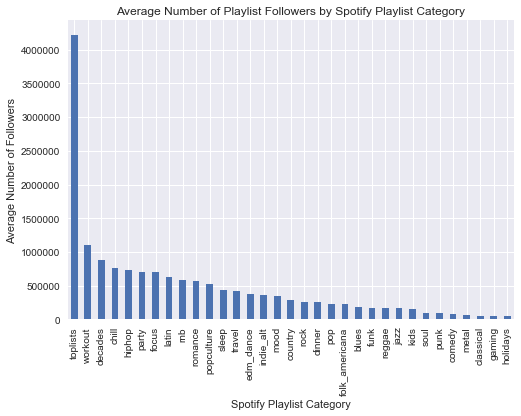
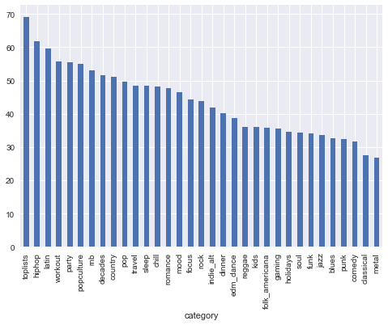
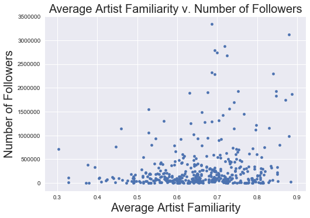
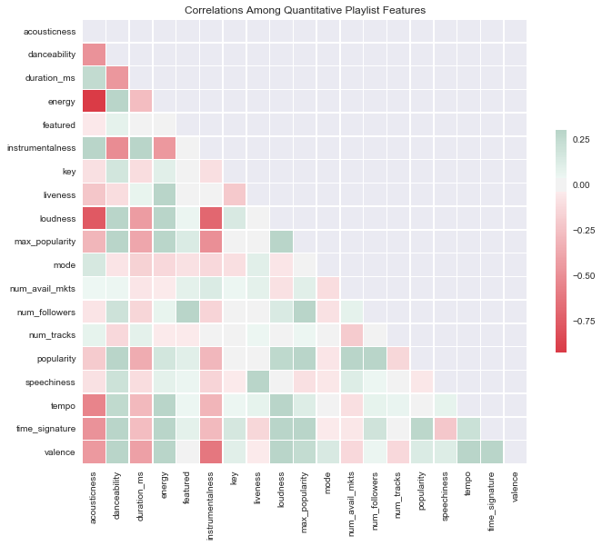

## Contents
{:.no_toc}
*  
{: toc}


```python
import numpy as np
import pandas as pd
import matplotlib
import matplotlib.pyplot as plt
%matplotlib inline
```


```python
#!pip install spotipy
```


```python
import sys
import spotipy
import spotipy.util as util

#authorize some stuff and test getting a list of my current saved tracks
import os
os.environ["SPOTIPY_CLIENT_ID"] = '3171b375071e4b4cac38e071125941d6'
os.environ["SPOTIPY_CLIENT_SECRET"] = '888d44a82ea5402fa3222339fc6e916a'
os.environ["SPOTIPY_REDIRECT_URI"] = 'http://localhost/'

scope = 'user-library-read'

if len(sys.argv) > 1:
    username = sys.argv[1]
else:
    print("Usage: %s username" % (sys.argv[0],))
    sys.exit()

token = util.prompt_for_user_token(username, scope)

if token:
    sp = spotipy.Spotify(auth=token)
    results = sp.current_user_saved_tracks()
    for item in results['items']:
        track = item['track']
        print(track['name'] + ' - ' + track['artists'][0]['name'])
else:
    print("Can't get token for", username)
    
#Test some stuff using T Swift
urn = 'spotify:artist:06HL4z0CvFAxyc27GXpf02'

sp.trace = False # turn off tracing
sp.trace_out = False # turn off trace out

#artist = sp.artist(urn)
#print(artist)


#user = sp.user('laylaokane')
#print(user)

```


    Nobody Else Will Be There - The National
    Day I Die - The National
    Walk It Back - The National
    The System Only Dreams in Total Darkness - The National
    Born to Beg - The National
    Turtleneck - The National
    Empire Line - The National
    I'll Still Destroy You - The National
    Guilty Party - The National
    Carin at the Liquor Store - The National
    Dark Side of the Gym - The National
    Sleep Well Beast - The National
    Frim Fram Sauce - Diana Krall
    Want You Back - HAIM
    Bad Blood - Taylor Swift
    The Modern Leper - Frightened Rabbit
    Bluebird - The Loreleis
    Celebrate - Ingrid Michaelson
    Hell No - Ingrid Michaelson
    Time to Pretend - MGMT


```python
#get categories of playlists
categories = sp.categories(country=None, locale=None, limit=50, offset=0)

```


```python
#Get the ids of categories
temp = categories['categories']

cat_ids = []
for item in temp['items']:
    cat_ids.append(item['id'])
print(cat_ids)
```


    ['toplists', 'holidays', 'chill', 'pop', 'mood', 'hiphop', 'edm_dance', 'party', 'rock', 'workout', 'focus', 'decades', 'dinner', 'sleep', 'indie_alt', 'rnb', 'popculture', 'metal', 'soul', 'romance', 'jazz', 'classical', 'latin', 'country', 'folk_americana', 'blues', 'travel', 'kids', 'reggae', 'gaming', 'punk', 'funk', 'comedy']


```python
#Get playlists for each of the ids of the categories
playlists = {}
for cat_id in cat_ids:
    playlists[cat_id] = sp.category_playlists(category_id=cat_id, country=None, limit=50, offset=0)

playlist_ids_by_cat = {}
for category, playlist in playlists.items():
    #print(playlist['playlists']['items'][0]['id'])
    playlist_ids_by_cat[category] = [x['id'] for x in playlist['playlists']['items']]

```


```python
'''
Useful track-getting functions!
'''

def spotify_id_to_isrc(spotify_ids):
    '''
    converts spotify ids to isrcs
    '''
    tracks = sp.tracks(spotify_ids)
    return [x['external_ids']['isrc']  for x in tracks['tracks']]

def isrc_to_spotify_id(isrcs):
    '''
    converts isrcs to spotify ids
    This takes a while since we need to search
    Is there a better way to get this info?
    Note: isrc --> spotify_id is not necessarily a one-to-one mapping (multiple spotify ids
    can map to the same isrc)
    ''' 
    ids = []
    for isrc in isrcs:
        ids.append(sp.search('isrc:'+isrc)['tracks']['items'][0]['id'])
    return ids

def get_popularity_and_markets(spotify_ids):
    rez = {}
    rez['popularity'] = []
    rez['num_avail_mkts'] =  []
    # only do 50 at a time for API stability
    chunk_size= 42
    for i in range(0, len(spotify_ids), chunk_size):
        chunk = spotify_ids[i:i+chunk_size]
        tracks = sp.tracks(chunk)
        rez['popularity'] = rez['popularity'] +  [x['popularity'] for x in tracks['tracks']]
        rez['num_avail_mkts'] = rez['num_avail_mkts'] + [len(x['available_markets']) for x in tracks['tracks']]
    rez['max_popularity'] = max(rez['popularity'])
    return pd.DataFrame(rez)

def get_followers(playlist_id, user = 'spotify'):
    playlist = sp.user_playlist(user, playlist_id=playlist_id, fields = ['followers'])
    return playlist['followers']['total']

#Default: US, 11/24/2017 at 8PM
def get_featured_playlists(country = 'US', time = '2017-11-24T18:00:00'):
    featured = sp.featured_playlists(country=country, timestamp=time, limit=50, offset=0)
    return [x['id'] for x in featured['playlists']['items']]

def get_track_ids(playlist_id = '37i9dQZF1DX3FNkD0kDpDV'):
    ''' 
    Given a Spotify Playlist ID, returns a list of spotify ids for songs in playlist
    '''
    offset = 0
    playlist = sp.user_playlist_tracks(user = 'spotify', playlist_id = playlist_id, limit = 100)
    ids = [x['track']['id']  for x in playlist['items']]
    # if we hit the limit, need to add more
    while len(ids) / (offset + 100) == 1:
        offset = offset + 100
        playlist = sp.user_playlist_tracks(user = 'spotify', playlist_id = playlist_id, limit = 100, offset = offset)
        ids = ids + [x['track']['id']  for x in playlist['items']]
    return ids

def get_track_audio_features(spotify_ids = get_track_ids()):
    'Given a list of spotify IDs, returns a dataframe of track audio features'
    chunk_size= 42
    tmp = {}
    for i in range(0, len(spotify_ids), chunk_size):
        chunk = spotify_ids[i:i+chunk_size]
        features = sp.audio_features(chunk)
        tmp_df = pd.DataFrame([x for x in features if isinstance(x, dict)])
        tmp.update(tmp_df.to_dict())
    df = pd.DataFrame(tmp)
    df = df.drop(['analysis_url', 'track_href', 'uri', 'type'], 1)
    return df

```


```python
import time
def get_playlist_data(playlist_ids):
    '''
    Given a list of Spotify playlist IDs, returns a dataframe containing a row
    for each inputed playlist with columns for the following data:
    1) *average* audio characteristics for the songs in that playlist:
        acousticness, danceability, duration,
        energy, instrumentalness, key, liveness, loudness, mode, tempo,
        valence, and time signature
    2) average popularity of songs in the playlist
    3) popularity of most popular song in playlist (might be an anchor song to the playlist)
    4) average # of markets the songs in the playlist are available i
    5) global playlist info
        - number of followers the playlist has (response variable?)
        - number of tracks in playlist
        - whether or not the playlist was "featured" on 11/24/2017 at 8PM
    '''
    rez = {}
    # force list
    if not isinstance(playlist_ids, list):
        playlist_ids = [playlist_ids]
        
    featured_playlists = get_featured_playlists()
    for playlist_id in playlist_ids:
        print('Getting info for: ' + playlist_id)
        tmp = {}
        try:
            track_ids = get_track_ids(playlist_id)
        except spotipy.client.SpotifyException:
            print('WARNING: Playlist does not exist. Skipping.')
            continue
        except:
            time.sleep(10)
            track_ids = get_track_ids(playlist_id)
        # get average audio characteristics
        audio_chars = get_track_audio_features(track_ids).mean().to_dict()
        # get popularity and markets
        pop_and_mkts = get_popularity_and_markets(track_ids).mean().to_dict()
        # get # followers
        tmp['num_followers'] = get_followers(playlist_id)
        tmp['num_tracks'] = len(track_ids)
        tmp['featured'] = 1 if playlist_id in featured_playlists else 0
        tmp.update(audio_chars)
        tmp.update(pop_and_mkts)
        rez[playlist_id] = tmp
    return pd.DataFrame(rez).T

data = {}
for cat, playlists in playlist_ids_by_cat.items():
    print('Starting Category: ' + cat)
    playlist_data = get_playlist_data(playlists)
    playlist_data['category'] = cat
    data.update(playlist_data.T.to_dict())

```


    Starting Category: popculture
    Getting info for: 37i9dQZF1DX44t7uCdkV1A
    Getting info for: 37i9dQZF1DX1328t2iygZy
    Getting info for: 37i9dQZF1DX4JAvHpjipBk
    Getting info for: 37i9dQZF1DXa3KA3nCTOQa
    Getting info for: 37i9dQZF1DX6R7YjFMxwJB
    Getting info for: 2pAubOpmQz0GgwcNZEMnsC
    WARNING: Playlist does not exist. Skipping.
    Getting info for: 2NoR0KhNZ8oZnC3HoNt2FV
    WARNING: Playlist does not exist. Skipping.
    Getting info for: 37i9dQZF1DWWjGdmeTyeJ6
    Getting info for: 37i9dQZF1DWWwaxRea1LWS
    Getting info for: 1RMWowofjrgGz9pUrLPHnX
    WARNING: Playlist does not exist. Skipping.
    Getting info for: 37i9dQZF1DX50yT1VeARvT
    Getting info for: 37i9dQZF1DX5qGup0t1SY0
    Getting info for: 37i9dQZF1DX9ZROpgFaLdL
    Getting info for: 37i9dQZF1DX2FcXrz51eUF
    Getting info for: 37i9dQZF1DX1H32MrlR3uQ
    Getting info for: 37i9dQZF1DX8ADx91pud0L
    Getting info for: 37i9dQZF1DX0fxvQuCbHMa
    Getting info for: 37i9dQZF1DX6QeEMcN5RiG
    Getting info for: 37i9dQZF1DWUnlVCphEp2r
    Getting info for: 37i9dQZF1DX5h8XoTduzLi
    Starting Category: workout
    Getting info for: 37i9dQZF1DX76Wlfdnj7AP
    Getting info for: 37i9dQZF1DXdxcBWuJkbcy
    Getting info for: 37i9dQZF1DWSJHnPb1f0X3
    Getting info for: 37i9dQZF1DX35oM5SPECmN
    Getting info for: 37i9dQZF1DX0HRj9P7NxeE
    Getting info for: 37i9dQZF1DX7cmFV9rWM0u
    Getting info for: 37i9dQZF1DX70RN3TfWWJh
    Getting info for: 37i9dQZF1DX4eRPd9frC1m
    Getting info for: 37i9dQZF1DWUVpAXiEPK8P
    Getting info for: 37i9dQZF1DX32NsLKyzScr
    Getting info for: 37i9dQZF1DWZYWNM3NfvzJ
    Getting info for: 37i9dQZF1DX4SO57lOJWRB
    Getting info for: 37i9dQZF1DXbFRZSqP41al
    Getting info for: 37i9dQZF1DX21UfQ8M3LWJ
    Getting info for: 37i9dQZF1DX0wiundViT27
    Getting info for: 37i9dQZF1DXbHrLkblwdd2
    Getting info for: 37i9dQZF1DXe6bgV3TmZOL
    Getting info for: 37i9dQZF1DX9BXb6GsGCLl
    Getting info for: 37i9dQZF1DWZUTt0fNaCPB
    Getting info for: 37i9dQZF1DX3IhTRuiR3nG
    Getting info for: 37i9dQZF1DWXUtxBFupUW9
    Getting info for: 37i9dQZF1DXaRL7xbcDl7X
    Getting info for: 37i9dQZF1DWY6FMdJgBpXg
    Getting info for: 37i9dQZF1DX3ZeFHRhhi7Y
    Getting info for: 37i9dQZF1DWUI1rlvkdQnb
    Starting Category: metal
    Getting info for: 37i9dQZF1DWTcqUzwhNmKv
    Getting info for: 37i9dQZF1DX2LTcinqsO68
    Getting info for: 37i9dQZF1DX5J7FIl4q56G
    Getting info for: 37i9dQZF1DWY5ai7gxfuaS
    Getting info for: 37i9dQZF1DWWOaP4H0w5b0
    Getting info for: 37i9dQZF1DXcfZ6moR6J0G
    Getting info for: 37i9dQZF1DXdpVGstUksUC
    Getting info for: 37i9dQZF1DX4jCqmsDQR1i
    Getting info for: 37i9dQZF1DX9qNs32fujYe
    Getting info for: 37i9dQZF1DWSfKFFAPxhCR
    Getting info for: 37i9dQZF1DWXDJDWnzE39E
    Getting info for: 37i9dQZF1DX5wgKYQVRARv
    Getting info for: 37i9dQZF1DX1cJWWyylDuw
    Getting info for: 37i9dQZF1DWWBZ8hj4jFBr
    Getting info for: 37i9dQZF1DWZdFtcHGe8ED
    Getting info for: 37i9dQZF1DX6GRSnGELn7L
    Getting info for: 37i9dQZF1DX1kydukZhLms
    Getting info for: 37i9dQZF1DX37bXS7EGI3f
    Getting info for: 37i9dQZF1DWY3PJWG3ogmJ
    Getting info for: 37i9dQZF1DXbl9rMxGEmRC
    Getting info for: 37i9dQZF1DX2lfnpRKY6V3
    Getting info for: 37i9dQZF1DWUk47CLxI4Uo
    Getting info for: 37i9dQZF1DX3USLhm5QxgA
    Getting info for: 37i9dQZF1DX1GZ9l4hvKSJ
    Getting info for: 37i9dQZF1DWWzcHhJ7FCIq
    Getting info for: 37i9dQZF1DWT9SRKhOEUYj
    Getting info for: 37i9dQZF1DX4Woqxy7tpda
    Getting info for: 37i9dQZF1DX7qU83RVkXfs
    Getting info for: 37i9dQZF1DX9RHDN6uTKnu
    Getting info for: 37i9dQZF1DX7Mxx64R4be0
    Getting info for: 37i9dQZF1DXcttH85SkV7u
    Getting info for: 37i9dQZF1DX3rgMQkVvtts
    Getting info for: 37i9dQZF1DX8GzEFe94amI
    Getting info for: 37i9dQZF1DX0FNUL0tXob1
    Getting info for: 37i9dQZF1DXcXKs2huoKPY
    Getting info for: 37i9dQZF1DXcWC95w8Zh09
    Getting info for: 37i9dQZF1DWYAJafROoFWU
    Getting info for: 37i9dQZF1DXcKmFL2DMoCZ
    Getting info for: 37i9dQZF1DXbs54Iceo1R0
    Starting Category: pop
    Getting info for: 37i9dQZF1DXcBWIGoYBM5M
    Getting info for: 37i9dQZF1DWUa8ZRTfalHk
    Getting info for: 37i9dQZF1DWYs83FtTMQFw
    Getting info for: 37i9dQZF1DX0s5kDXi1oC5
    Getting info for: 37i9dQZF1DWXJfnUiYjUKT
    Getting info for: 37i9dQZF1DX0MLFaUdXnjA
    Getting info for: 37i9dQZF1DWYp3yzk1civi
    Getting info for: 37i9dQZF1DX4v0Y84QklHD
    Getting info for: 37i9dQZF1DWY8U6Zq7nvbE
    Getting info for: 37i9dQZF1DX4pUKG1kS0Ac
    Getting info for: 37i9dQZF1DXd28jAsVoMbV
    Getting info for: 37i9dQZF1DXcTieYAg7jq1
    Getting info for: 37i9dQZF1DWYs2pvwxWA7l
    Getting info for: 37i9dQZF1DX3HYlktiFpE6
    Starting Category: classical
    Getting info for: 37i9dQZF1DWV0gynK7G6pD
    Getting info for: 37i9dQZF1DX21bRPJuEN7r
    Getting info for: 37i9dQZF1DXaky0wMRgvaj
    Getting info for: 37i9dQZF1DX0z6CeZuw5dA
    Getting info for: 37i9dQZF1DX0DHxkHcf1Tl
    Getting info for: 37i9dQZF1DWVlfUhqkKnT8
    Getting info for: 37i9dQZF1DXdazL2M92igj
    Getting info for: 37i9dQZF1DWWEJlAGA9gs0
    Getting info for: 37i9dQZF1DX4P0ijJK5lUv
    Getting info for: 37i9dQZF1DXah8e1pvF5oE
    Getting info for: 37i9dQZF1DXcN1fAVSf7CR
    Getting info for: 37i9dQZF1DX4s3V2rTswzO
    Getting info for: 37i9dQZF1DWT7cP2sXl1Gf
    Getting info for: 37i9dQZF1DX7cBprxbt1Fn
    Getting info for: 37i9dQZF1DX2d2B80QbRDa
    Getting info for: 37i9dQZF1DX561TxkFttR4
    Getting info for: 37i9dQZF1DX2mmt7R81K2b
    Getting info for: 37i9dQZF1DX9G9wwzwWL2k
    Getting info for: 37i9dQZF1DWUPafHP1BJw1
    Getting info for: 37i9dQZF1DXbIeCFU20wRm
    Getting info for: 37i9dQZF1DWUqIzZNMSCv3
    Getting info for: 37i9dQZF1DX9OZisIoJQhG
    Getting info for: 37i9dQZF1DWXjj6kdiviS0
    Getting info for: 37i9dQZF1DX6K3W8KBiALe
    Getting info for: 37i9dQZF1DWYi4w24l7FTx
    Getting info for: 37i9dQZF1DX43qoHiOOgIz
    Getting info for: 37i9dQZF1DXbrSeoLHavML
    Getting info for: 37i9dQZF1DWVfS4Cdd3PNf
    Getting info for: 37i9dQZF1DWUwJtOwikfWr
    Getting info for: 37i9dQZF1DX0i61tT0OnnK
    Getting info for: 37i9dQZF1DWXBq4mDDFnfA
    Getting info for: 37i9dQZF1DX0ynPp7KaiSY
    Getting info for: 37i9dQZF1DXddGd6mP5X2a
    Getting info for: 37i9dQZF1DXbw9rGYPXetO
    Getting info for: 37i9dQZF1DX10uaP8FoDNe
    Getting info for: 37i9dQZF1DXabrEiRjQMgs
    Getting info for: 37i9dQZF1DWWusEYOQAF3N
    Getting info for: 37i9dQZF1DXbaZdHeCwl9C
    Getting info for: 37i9dQZF1DX8qDhzfjyTN6
    Getting info for: 37i9dQZF1DWYZW76Iw4Lij
    Getting info for: 37i9dQZF1DXbm0dp7JzNeL
    Getting info for: 37i9dQZF1DX2aCk0vzzaZQ
    Getting info for: 37i9dQZF1DWSXyN2w7ILMl
    Getting info for: 37i9dQZF1DWYtpM7d4h5Xa
    Getting info for: 37i9dQZF1DXd7PzoVhovvO
    Getting info for: 37i9dQZF1DX7TvcXU5TLWg
    Getting info for: 37i9dQZF1DWUqr1os0aCxH
    Getting info for: 37i9dQZF1DWSNNoRF9meHq
    Getting info for: 37i9dQZF1DWVCndJIeGywh
    Getting info for: 37i9dQZF1DWWISLnAIWyCZ
    Starting Category: comedy
    Getting info for: 37i9dQZF1DWSRoT7QRAibZ
    Getting info for: 37i9dQZF1DWWfTJcFZsvJO
    Starting Category: latin
    Getting info for: 37i9dQZF1DWY7IeIP1cdjF
    Getting info for: 37i9dQZF1DX10zKzsJ2jva
    Getting info for: 37i9dQZF1DX2apWzyECwyZ
    Getting info for: 37i9dQZF1DXde9tuMHuIsj
    Getting info for: 37i9dQZF1DX1QnNyJOBQBv
    Getting info for: 37i9dQZF1DXdvS2NyOOTU3
    Getting info for: 37i9dQZF1DX3omIq8ziEt6
    Getting info for: 37i9dQZF1DX2GUTPJqQ9sH
    Getting info for: 37i9dQZF1DX8sljIJzI0oo
    Getting info for: 37i9dQZF1DWZoF06RIo9el
    Getting info for: 37i9dQZF1DX7MTlMMRl0MD
    Getting info for: 37i9dQZF1DX7cmFV9rWM0u
    Getting info for: 37i9dQZF1DX8SfyqmSFDwe
    Getting info for: 37i9dQZF1DX6ThddIjWuGT
    Getting info for: 37i9dQZF1DX4qKWGR9z0LI
    Getting info for: 37i9dQZF1DWUoGbRYcteyC
    Getting info for: 37i9dQZF1DWVcbzTgVpNRm
    Getting info for: 37i9dQZF1DWYey22ryYM8U
    Getting info for: 37i9dQZF1DX4BuQ60PYeRb
    Getting info for: 37i9dQZF1DX4OjfOteYnH8
    Getting info for: 37i9dQZF1DWX5ZOsG2Ogi1
    Getting info for: 37i9dQZF1DWTyvco9C4Og0
    Getting info for: 37i9dQZF1DWZdsS73T1ogG
    Getting info for: 37i9dQZF1DX4Xv3b1fFYlX
    Getting info for: 37i9dQZF1DXbHrLkblwdd2
    Getting info for: 37i9dQZF1DX661EjJOj3Tu
    Getting info for: 37i9dQZF1DWVLoqOzktoRS
    Getting info for: 37i9dQZF1DX1hVRardJ30X
    Getting info for: 37i9dQZF1DWZJIhAWlsiOv
    Getting info for: 37i9dQZF1DWZVzvqm7nqns
    Getting info for: 37i9dQZF1DX8womvTyUjrN
    Getting info for: 37i9dQZF1DX53wq0WYtg5L
    Getting info for: 37i9dQZF1DX3Xgp6iJAFjW
    Getting info for: 37i9dQZF1DWWAKGqD5yOCl
    Getting info for: 37i9dQZF1DXbqgzgKwCf4q
    Getting info for: 37i9dQZF1DX8qhRpXsdDY5
    Getting info for: 37i9dQZF1DX5UTavgI6ivn
    Getting info for: 37i9dQZF1DX5AVYhCeISA6
    Getting info for: 37i9dQZF1DX2zAr9vdmFlU
    Getting info for: 37i9dQZF1DWTgSTuHRv7LV
    Getting info for: 37i9dQZF1DX1bz9ZyZY7qg
    Getting info for: 37i9dQZF1DX2QYsoI8NDDe
    Getting info for: 37i9dQZF1DWWUPI9iLRwxy
    Getting info for: 37i9dQZF1DX65py6HnnlE1
    Getting info for: 37i9dQZF1DWVAa4Dwc5f7L
    Getting info for: 37i9dQZF1DX8AjME0HhWBt
    Getting info for: 37i9dQZF1DX8DSRR3tGze6
    Getting info for: 37i9dQZF1DWWMMY2y10lFp
    Getting info for: 37i9dQZF1DX6FhkMXKOs07
    Getting info for: 37i9dQZF1DWV5sGFwUJeqR
    Starting Category: soul
    Getting info for: 37i9dQZF1DX6VDO8a6cQME
    Getting info for: 37i9dQZF1DX2UgsUIg75Vg
    Getting info for: 37i9dQZF1DX62Nfha2yFhL
    Getting info for: 37i9dQZF1DWVEvzGeX3eRs
    Getting info for: 37i9dQZF1DX5lDysu4GbKR
    Getting info for: 37i9dQZF1DWSXWSaQmvWOB
    Getting info for: 37i9dQZF1DXcAiMO5AYxE8
    Getting info for: 37i9dQZF1DX3KoYiZJ8DD4
    Getting info for: 37i9dQZF1DX0H8hDpv38Ju
    Getting info for: 37i9dQZF1DWULEW2RfoSCi
    Getting info for: 37i9dQZF1DX2Ma8k80RiMN
    Getting info for: 37i9dQZF1DX44dZ4p5QLf4
    Getting info for: 37i9dQZF1DXea80XwOJRgD
    Getting info for: 37i9dQZF1DX4GMJS146m00
    Starting Category: indie_alt
    Getting info for: 37i9dQZF1DX2Nc3B70tvx0
    Getting info for: 37i9dQZF1DXdbXrPNafg9d
    Getting info for: 37i9dQZF1DWVTKDs2aOkxu
    Getting info for: 37i9dQZF1DX2sUQwD7tbmL
    Getting info for: 37i9dQZF1DWYBF1dYDPlHw
    Getting info for: 37i9dQZF1DXbBKF9yWSvWR
    Getting info for: 37i9dQZF1DX26DKvjp0s9M
    Getting info for: 1NR9IyZLoK6OvLN5uqFcWV
    WARNING: Playlist does not exist. Skipping.
    Getting info for: 37i9dQZF1DWWEcRhUVtL8n
    Getting info for: 37i9dQZF1DXazOBCyyv15E
    Getting info for: 37i9dQZF1DX9myttyycIxA
    Getting info for: 37i9dQZF1DX2taNm7KfjOX
    Getting info for: 37i9dQZF1DX8CopunbDxgW
    Getting info for: 37i9dQZF1DX91UQmVbQYyN
    Getting info for: 37i9dQZF1DXcDnIr0iKAG8
    Getting info for: 37i9dQZF1DXa6YOhGMjjgx
    Getting info for: 37i9dQZF1DXaVgr4Tx5kRF
    Getting info for: 37i9dQZF1DX6mvEU1S6INL
    Getting info for: 37i9dQZF1DX5WTH49Vcnqp
    Getting info for: 37i9dQZF1DXdTCdwCKzXwo
    Getting info for: 37i9dQZF1DXbB7yFaZiAQX
    Getting info for: 37i9dQZF1DXdTb8AG95jne
    Getting info for: 37i9dQZF1DWSrj7tqQ9IOu
    Getting info for: 37i9dQZF1DX2I7Ykltk83m
    Starting Category: rnb
    Getting info for: 37i9dQZF1DX4SBhb3fqCJd
    Getting info for: 37i9dQZF1DWUzFXarNiofw
    Getting info for: 37i9dQZF1DX4y8h9WqDPAE
    Getting info for: 37i9dQZF1DWXnexX7CktaI
    Getting info for: 37i9dQZF1DXaTIN6XNquoW
    Getting info for: 37i9dQZF1DX6JzJ8vAK836
    Getting info for: 37i9dQZF1DWYmmr74INQlb
    Getting info for: 37i9dQZF1DX6VDO8a6cQME
    Getting info for: 37i9dQZF1DX2UgsUIg75Vg
    Getting info for: 37i9dQZF1DX0QKpU3cGsyb
    Getting info for: 37i9dQZF1DX62Nfha2yFhL
    Getting info for: 37i9dQZF1DWSfMe9z89s9B
    Getting info for: 37i9dQZF1DWVEvzGeX3eRs
    Getting info for: 37i9dQZF1DX8mAKxELU4b0
    Getting info for: 37i9dQZF1DWVklJ1urtT0p
    Getting info for: 37i9dQZF1DX7OIddoQVdRt
    Getting info for: 37i9dQZF1DX0H8hDpv38Ju
    Getting info for: 37i9dQZF1DX2Ma8k80RiMN
    Getting info for: 37i9dQZF1DXab8DipvnuNU
    Getting info for: 37i9dQZF1DWY12BqhkMFW2
    Starting Category: country
    Getting info for: 37i9dQZF1DX1lVhptIYRda
    Getting info for: 37i9dQZF1DX8S0uQvJ4gaa
    Getting info for: 37i9dQZF1DX5mB2C8gBeUM
    Getting info for: 37i9dQZF1DWYnwbYQ5HnZU
    Getting info for: 37i9dQZF1DWTkxQvqMy4WW
    Getting info for: 37i9dQZF1DX8WMG8VPSOJC
    Getting info for: 37i9dQZF1DWYiR2Uqcon0X
    Getting info for: 37i9dQZF1DWVpjAJGB70vU
    Getting info for: 37i9dQZF1DXdgnLr18vPvu
    Getting info for: 37i9dQZF1DWXi7h4mmmkzD
    Getting info for: 37i9dQZF1DX7aUUBCKwo4Y
    Getting info for: 37i9dQZF1DWXU4C3nPzApC
    Getting info for: 37i9dQZF1DX3Ee0ngF5ZVQ
    Getting info for: 37i9dQZF1DXbDjX0hus3Iu
    Getting info for: 37i9dQZF1DX75bySfirAbH
    Getting info for: 37i9dQZF1DX24Kh15JFQJ0
    Getting info for: 37i9dQZF1DXdXh4ecan7Hh
    Getting info for: 37i9dQZF1DX9nWj0Ba73K5
    Starting Category: funk
    Getting info for: 37i9dQZF1DX4WgZiuR77Ef
    Getting info for: 4xFSdiuP4gpR4wq2OghlOs
    WARNING: Playlist does not exist. Skipping.
    Getting info for: 37i9dQZF1DX23YPJntYMnh
    Getting info for: 37i9dQZF1DX48ZHftL4a1N
    Getting info for: 37i9dQZF1DX70TzPK5buVf
    Getting info for: 37i9dQZF1DWZXHVUlGM9Wp
    Getting info for: 37i9dQZF1DWZgauS5j6pMv
    Getting info for: 37i9dQZF1DX2GKumqRIZ7g
    Getting info for: 37i9dQZF1DX0N8QTiMHLoT
    Getting info for: 1nztK0z65hRvPVPe2ZF3Oj
    WARNING: Playlist does not exist. Skipping.
    Getting info for: 37i9dQZF1DX1MUPbVKMgJE
    Getting info for: 37i9dQZF1DXcAiMO5AYxE8
    Getting info for: 37i9dQZF1DX6drTZKzZwSo
    Getting info for: 37i9dQZF1DX8f5qTGj8FYl
    Getting info for: 37i9dQZF1DWUS3jbm4YExP
    Getting info for: 37i9dQZF1DXdJyxIBq7Xdy
    Starting Category: focus
    Getting info for: 37i9dQZF1DX4sWSpwq3LiO
    Getting info for: 37i9dQZF1DX3PFzdbtx1Us
    Getting info for: 37i9dQZF1DX8NTLI2TtZa6
    Getting info for: 37i9dQZF1DX8ymr6UES7vc
    Getting info for: 37i9dQZF1DX3PIPIT6lEg5
    Getting info for: 37i9dQZF1DWUZ5bk6qqDSy
    Getting info for: 37i9dQZF1DWXLeA8Omikj7
    Getting info for: 37i9dQZF1DX0jgyAiPl8Af
    Getting info for: 37i9dQZF1DX9sIqqvKsjG8
    Getting info for: 37i9dQZF1DX4PP3DA4J0N8
    Getting info for: 37i9dQZF1DXcLDm348RRYK
    Getting info for: 37i9dQZF1DWSluGMsH1R9r
    Getting info for: 37i9dQZF1DWZIOAPKUdaKS
    Getting info for: 37i9dQZF1DWXrDQedVqw6q
    Getting info for: 37i9dQZF1DWT5lkChsPmpy
    Getting info for: 37i9dQZF1DWU6Vfrf87eTG
    Getting info for: 37i9dQZF1DWWTdxbiocWOL
    Starting Category: travel
    Getting info for: 37i9dQZF1DWU13kKnk03AP
    Getting info for: 37i9dQZF1DX9wC1KY45plY
    Getting info for: 37i9dQZF1DWWMOmoXKqHTD
    Getting info for: 37i9dQZF1DWWiDhnQ2IIru
    Getting info for: 37i9dQZF1DX2MyUCsl25eb
    Getting info for: 37i9dQZF1DWTlgzqHpWg4m
    Getting info for: 37i9dQZF1DWUoqEG4WY6ce
    Getting info for: 37i9dQZF1DX3bSdu6sAEDF
    Getting info for: 37i9dQZF1DWTJ0ewkTmTo2
    Getting info for: 37i9dQZF1DWXS0qyx76B7l
    Getting info for: 37i9dQZF1DWUvHZA1zLcjW
    Getting info for: 37i9dQZF1DXdkAbM8agIbA
    Getting info for: 37i9dQZF1DWYDwcSz4xLNu
    Getting info for: 37i9dQZF1DWV8IND7NkP2W
    Getting info for: 37i9dQZF1DX3sCx6B9EAOr
    Getting info for: 37i9dQZF1DWZwIe6oLhjPr
    Getting info for: 37i9dQZF1DX26qL5VIKpzo
    Starting Category: mood
    Getting info for: 37i9dQZF1DWSqmBTGDYngZ
    Getting info for: 37i9dQZF1DWXLeA8Omikj7
    Getting info for: 37i9dQZF1DX6ziVCJnEm59
    Getting info for: 37i9dQZF1DWU0ScTcjJBdj
    Getting info for: 37i9dQZF1DX3PIPIT6lEg5
    Getting info for: 37i9dQZF1DX7K31D69s4M1
    Getting info for: 37i9dQZF1DWTkxQvqMy4WW
    Getting info for: 37i9dQZF1DX9XIFQuFvzM4
    Getting info for: 37i9dQZF1DX4H7FFUM2osB
    Getting info for: 37i9dQZF1DX8WMG8VPSOJC
    Getting info for: 37i9dQZF1DXdsy92d7BLpC
    Getting info for: 37i9dQZF1DWVV27DiNWxkR
    Getting info for: 37i9dQZF1DWYiR2Uqcon0X
    Getting info for: 37i9dQZF1DXca8AyWK6Y7g
    Getting info for: 37i9dQZF1DWVzZlRWgqAGH
    Getting info for: 37i9dQZF1DWXi7h4mmmkzD
    Getting info for: 37i9dQZF1DWYqdkUCLfYzP
    Getting info for: 37i9dQZF1DWTtTyjgd08yp
    Getting info for: 37i9dQZF1DWSf2RDTDayIx
    Getting info for: 37i9dQZF1DX4CgJVlGEIo5
    Getting info for: 37i9dQZF1DXdgz8ZB7c2CP
    Getting info for: 37i9dQZF1DX2pSTOxoPbx9
    Getting info for: 37i9dQZF1DX3ohNxI5tB79
    Getting info for: 37i9dQZF1DX4nb8GbLLOhT
    Getting info for: 37i9dQZF1DXa9xHlDa5fc6
    Getting info for: 37i9dQZF1DXarebqD2nAVg
    Getting info for: 37i9dQZF1DXaXDsfv6nvZ5
    Getting info for: 37i9dQZF1DX0IyMQV27EGn
    Getting info for: 37i9dQZF1DX79Y9Kr2M2tM
    Getting info for: 37i9dQZF1DXa2PsvJSPnPf
    Getting info for: 37i9dQZF1DWU8quswnFt3c
    Getting info for: 37i9dQZF1DX8ZiJCz5fADR
    Getting info for: 37i9dQZF1DWVxpHBekDUXK
    Getting info for: 37i9dQZF1DX6FpuSJJgdDF
    Getting info for: 37i9dQZF1DX1uG5byNIgDA
    Getting info for: 37i9dQZF1DXaFIIlnFUS86
    Getting info for: 37i9dQZF1DX4ALYsOGumV8
    Starting Category: blues
    Getting info for: 37i9dQZF1DX9stbPFTxeaB
    Getting info for: 37i9dQZF1DX2iUghHXGIjj
    Getting info for: 37i9dQZF1DXbkKnGZHv1kf
    Getting info for: 37i9dQZF1DWWyCCtyRAvGr
    Getting info for: 37i9dQZF1DWXbxDw7wBcIC
    Getting info for: 37i9dQZF1DXaOY0OtmgxB8
    Getting info for: 37i9dQZF1DX5AuRugisweW
    Getting info for: 37i9dQZF1DXcnkReojaCnV
    Getting info for: 37i9dQZF1DXaOWYud3Cg4V
    Getting info for: 37i9dQZF1DWXEV4YwX6nMt
    Getting info for: 37i9dQZF1DX8QB9Ys2nV17
    Getting info for: 37i9dQZF1DX7Y7BqFok9IQ
    Getting info for: 37i9dQZF1DXdkAbM8agIbA
    Starting Category: chill
    Getting info for: 37i9dQZF1DWXLeA8Omikj7
    Getting info for: 37i9dQZF1DX6ziVCJnEm59
    Getting info for: 37i9dQZF1DX0SM0LYsmbMT
    Getting info for: 37i9dQZF1DX6VdMW310YC7
    Getting info for: 37i9dQZF1DX3PIPIT6lEg5
    Getting info for: 37i9dQZF1DWTkxQvqMy4WW
    Getting info for: 37i9dQZF1DX9uKNf5jGX6m
    Getting info for: 37i9dQZF1DX8WMG8VPSOJC
    Getting info for: 37i9dQZF1DXc8kgYqQLMfH
    Getting info for: 37i9dQZF1DX2TRYkJECvfC
    Getting info for: 37i9dQZF1DX504r1DvyvxG
    Getting info for: 37i9dQZF1DWVFJtzvDHN4L
    Getting info for: 37i9dQZF1DWVIzZt2GAU4X
    Getting info for: 37i9dQZF1DX889U0CL85jj
    Getting info for: 37i9dQZF1DWYiR2Uqcon0X
    Getting info for: 37i9dQZF1DXci7j0DJQgGp
    Getting info for: 37i9dQZF1DWVvXA824aCbn
    Getting info for: 37i9dQZF1DWZqd5JICZI0u
    Getting info for: 37i9dQZF1DXdCsscAsbRNz
    Getting info for: 37i9dQZF1DWXi7h4mmmkzD
    Getting info for: 37i9dQZF1DX8ymr6UES7vc
    Getting info for: 37i9dQZF1DWZ0OzPeadl0h
    Getting info for: 37i9dQZF1DX83I5je4W4rP
    Getting info for: 37i9dQZF1DX1T2fEo0ROQ2
    Getting info for: 37i9dQZF1DX4Q2SnB3glnP
    Getting info for: 37i9dQZF1DWXIFKBoyoLJJ
    Getting info for: 37i9dQZF1DX1wdZM1FEz79
    Getting info for: 37i9dQZF1DWTA0RRFCoIUN
    Getting info for: 37i9dQZF1DX32oVqaQE8BM
    Getting info for: 37i9dQZF1DXa9xHlDa5fc6
    Getting info for: 37i9dQZF1DX571ttkrxAeN
    Getting info for: 37i9dQZF1DX5bjCEbRU4SJ
    Getting info for: 37i9dQZF1DWXnscMH24yOc
    Getting info for: 37i9dQZF1DXebxttQCq0zA
    Getting info for: 37i9dQZF1DX1tuUiirhaT3
    Getting info for: 37i9dQZF1DWTVIaV4KJYuq
    Getting info for: 37i9dQZF1DWUqrCZuubr1Q
    Getting info for: 37i9dQZF1DX9XdJRfSK6a0
    Getting info for: 37i9dQZF1DX6tTW0xDxScH
    Getting info for: 37i9dQZF1DXdL58DnQ4ZqM
    Starting Category: edm_dance
    Getting info for: 37i9dQZF1DX4dyzvuaRJ0n
    Getting info for: 37i9dQZF1DX8tZsk68tuDw
    Getting info for: 37i9dQZF1DXcZDD7cfEKhW
    Getting info for: 37i9dQZF1DX0BcQWzuB7ZO
    Getting info for: 37i9dQZF1DXa41CMuUARjl
    Getting info for: 37i9dQZF1DX2vEc9fKrard
    Getting info for: 37i9dQZF1DX8CopunbDxgW
    Getting info for: 37i9dQZF1DX8a1tdzq5tbM
    Getting info for: 37i9dQZF1DXaXB8fQg7xif
    Getting info for: 37i9dQZF1DX6VdMW310YC7
    Getting info for: 37i9dQZF1DXa8NOEUWPn9W
    Getting info for: 37i9dQZF1DX6GJXiuZRisr
    Getting info for: 37i9dQZF1DX0pH2SQMRXnC
    Getting info for: 37i9dQZF1DX3FNkD0kDpDV
    Getting info for: 37i9dQZF1DX1OIMC8iDi74
    Getting info for: 37i9dQZF1DWT8fmnlYTQW3
    Getting info for: 37i9dQZF1DWTTeiOiaofQh
    Getting info for: 37i9dQZF1DWV6K3lprq7Lc
    Getting info for: 37i9dQZF1DWUq3wF0JVtEy
    Getting info for: 37i9dQZF1DX3ND264N08pv
    Getting info for: 37i9dQZF1DX2pprEpa9URZ
    Getting info for: 37i9dQZF1DX8XRQHfrER1j
    Getting info for: 37i9dQZF1DX9cbNxuNYT3d
    Getting info for: 37i9dQZF1DWXCIgX3kyeVF
    Getting info for: 37i9dQZF1DX1tW4VlEfDSS
    Getting info for: 37i9dQZF1DWUraJYejk11q
    Getting info for: 37i9dQZF1DWVY4eLfA3XFQ
    Getting info for: 37i9dQZF1DX0r3x8OtiwEM
    Getting info for: 37i9dQZF1DX5Q27plkaOQ3
    Getting info for: 37i9dQZF1DXbXD9pMSZomS
    Getting info for: 37i9dQZF1DX7Q7o98uPeg1
    Getting info for: 37i9dQZF1DX91oIci4su1D
    Getting info for: 37i9dQZF1DX2VvACCrgjrt
    Getting info for: 37i9dQZF1DXcWvfTQnPUwI
    Getting info for: 37i9dQZF1DX4pbGJDhTXK3
    Getting info for: 37i9dQZF1DX5grnAKI2SEV
    Getting info for: 37i9dQZF1DX5GiUwx1edLZ
    Getting info for: 37i9dQZF1DWTfrr8pte1rT
    Getting info for: 37i9dQZF1DWZtGWF9Ltb0N
    Getting info for: 37i9dQZF1DX2JKi7oFC6Jv
    Getting info for: 37i9dQZF1DWYzMfRQj22Nd
    Getting info for: 37i9dQZF1DX5YyEO1dtgbR
    Getting info for: 37i9dQZF1DX3XjJqhm9fqD
    Starting Category: hiphop
    Getting info for: 37i9dQZF1DX0XUsuxWHRQd
    Getting info for: 37i9dQZF1DX2RxBh64BHjQ
    Getting info for: 37i9dQZF1DX2A29LI7xHn1
    Getting info for: 37i9dQZF1DWVA1Gq4XHa6U
    Getting info for: 37i9dQZF1DWY4xHQp97fN6
    Getting info for: 37i9dQZF1DX186v583rmzp
    Getting info for: 37i9dQZF1DWT6MhXz0jw61
    Getting info for: 37i9dQZF1DWSOkubnsDCSS
    Getting info for: 37i9dQZF1DWYkaDif7Ztbp
    Getting info for: 37i9dQZF1DX5jNEiuvPyWr
    Getting info for: 37i9dQZF1DXaxIqwkEGFEh
    Getting info for: 37i9dQZF1DWSvKsRPPnv5o
    Getting info for: 37i9dQZF1DWW46Vfs1oltB
    Getting info for: 37i9dQZF1DX0Tkc6ltcBfU
    Getting info for: 37i9dQZF1DWSTeI2WWFaia
    Getting info for: 37i9dQZF1DX36Xw4IJIVKA
    Getting info for: 37i9dQZF1DX3KoYiZJ8DD4
    Getting info for: 37i9dQZF1DWT6SJaitNDax
    Getting info for: 37i9dQZF1DX9ZROpgFaLdL
    Getting info for: 37i9dQZF1DXcA6dRp8rwj6
    Starting Category: jazz
    Getting info for: 37i9dQZF1DWVqfgj8NZEp1
    Getting info for: 37i9dQZF1DX7YCknf2jT6s
    Getting info for: 37i9dQZF1DX4wta20PHgwo
    Getting info for: 37i9dQZF1DX5OepaGriAIm
    Getting info for: 37i9dQZF1DWVvXA824aCbn
    Getting info for: 37i9dQZF1DWTlzJXLRpd4a
    Getting info for: 37i9dQZF1DX0aSJooo0zWR
    Getting info for: 37i9dQZF1DWYgA6FKKHSd6
    Getting info for: 37i9dQZF1DWVx3vT1QCKCV
    Getting info for: 37i9dQZF1DXdDe8IDhRIo5
    Getting info for: 7zTDNVYZZx7NPoTP1BM5xz
    WARNING: Playlist does not exist. Skipping.
    Getting info for: 37i9dQZF1DXbITWG1ZJKYt
    Getting info for: 37i9dQZF1DX7UE7qrnkvsf
    Getting info for: 37i9dQZF1DWSBRKlyNxSuy
    Getting info for: 37i9dQZF1DX3BqHI5fuXWV
    Getting info for: 3WHVW1ShCZMbClR5h4enKe
    Getting info for: 37i9dQZF1DX44YhigDocag
    Getting info for: 37i9dQZF1DX0SM0LYsmbMT
    Getting info for: 37i9dQZF1DWTbzY5gOVvKd
    Getting info for: 37i9dQZF1DWVzZlRWgqAGH
    Getting info for: 37i9dQZF1DX55dNU0PWnO5
    Getting info for: 37i9dQZF1DX661EjJOj3Tu
    Getting info for: 37i9dQZF1DX6G7arXBXa3A
    Getting info for: 37i9dQZF1DWY3X53lmPYk9
    Getting info for: 37i9dQZF1DX2mmt7R81K2b
    Getting info for: 37i9dQZF1DX5Lf3LZ6Czqu
    Starting Category: party
    Getting info for: 37i9dQZF1DX3FNkD0kDpDV
    Getting info for: 37i9dQZF1DX1N5uK98ms5p
    Getting info for: 37i9dQZF1DXcRXFNfZr7Tp
    Getting info for: 37i9dQZF1DX4RDXswvP6Mj
    Getting info for: 37i9dQZF1DX0Uv9tZ47pWo
    Getting info for: 37i9dQZF1DXaXB8fQg7xif
    Getting info for: 37i9dQZF1DWVUswLRxqswT
    Getting info for: 37i9dQZF1DWYmmr74INQlb
    Getting info for: 34max3McbbzvwaVdv3RaBp
    WARNING: Playlist does not exist. Skipping.
    Getting info for: 37i9dQZF1DXdsy92d7BLpC
    Getting info for: 37i9dQZF1DX0d48cgAWUSF
    Getting info for: 37i9dQZF1DX7F6T2n2fegs
    Getting info for: 37i9dQZF1DXab8DipvnuNU
    Getting info for: 37i9dQZF1DWVcbzTgVpNRm
    Getting info for: 37i9dQZF1DXdgnLr18vPvu
    Getting info for: 37i9dQZF1DWTLrNDPW5co2
    Starting Category: sleep
    Getting info for: 37i9dQZF1DWZd79rJ6a7lp
    Getting info for: 37i9dQZF1DXdCsscAsbRNz
    Getting info for: 37i9dQZF1DXbcPC6Vvqudd
    Getting info for: 37i9dQZF1DX4sWSpwq3LiO
    Getting info for: 37i9dQZF1DWYcDQ1hSjOpY
    Getting info for: 37i9dQZF1DWUZ5bk6qqDSy
    Getting info for: 37i9dQZF1DX0jgyAiPl8Af
    Getting info for: 37i9dQZF1DX4aYNO8X5RpR
    Getting info for: 37i9dQZF1DXa1rZf8gLhyz
    Getting info for: 37i9dQZF1DX0x36cwEyOTG
    Getting info for: 37i9dQZF1DWUKPeBypcpcP
    Getting info for: 37i9dQZF1DX9if5QDLdzCa
    Getting info for: 37i9dQZF1DWSiZVO2J6WeI
    Getting info for: 37i9dQZF1DWSUFOo47GEsI
    Getting info for: 37i9dQZF1DX1n9whBbBKoL
    Getting info for: 37i9dQZF1DXbADqT0j1Cxt
    Getting info for: 37i9dQZF1DWXtXDrhlJ17q
    Getting info for: 37i9dQZF1DX5FuBDzVtEFX
    Getting info for: 37i9dQZF1DX9NmDLwNQnXE
    Getting info for: 37i9dQZF1DWWSads6V2oIk
    Getting info for: 37i9dQZF1DWXzR2GKEiHgT
    Getting info for: 37i9dQZF1DXdbkmlag2h7b
    Getting info for: 37i9dQZF1DX0DxcHtn4Hwo
    Getting info for: 37i9dQZF1DWTRnup1IgL4a
    Getting info for: 37i9dQZF1DXaw68inx4UiN
    Getting info for: 37i9dQZF1DWVLoqOzktoRS
    Getting info for: 37i9dQZF1DXb6LkIGouseT
    Getting info for: 37i9dQZF1DX0ES2mnOVvai
    Getting info for: 37i9dQZF1DWWtqHeytOZ8f
    Starting Category: decades
    Getting info for: 37i9dQZF1DX4UtSsGT1Sbe
    Getting info for: 37i9dQZF1DXbTxeAdrVG2l
    Getting info for: 37i9dQZF1DWTJ7xPn4vNaz
    Getting info for: 37i9dQZF1DX4o1oenSJRJd
    Getting info for: 37i9dQZF1DXaKIA8E7WcJj
    Getting info for: 37i9dQZF1DWZn9s1LNKPiM
    Getting info for: 37i9dQZF1DWUH2AzNQzWua
    Getting info for: 37i9dQZF1DXb9LIXaj5WhL
    Getting info for: 37i9dQZF1DX3YMp9n8fkNx
    Getting info for: 37i9dQZF1DX68H8ZujdnN7
    Getting info for: 37i9dQZF1DWSV3Tk4GO2fq
    Getting info for: 37i9dQZF1DXdTCdwCKzXwo
    Getting info for: 37i9dQZF1DX8a1tdzq5tbM
    Getting info for: 37i9dQZF1DXbB7yFaZiAQX
    Getting info for: 37i9dQZF1DX3Gj7nguS95W
    Getting info for: 37i9dQZF1DX94QVAxB7Dum
    Getting info for: 37i9dQZF1DX6b6iwWdOkRd
    Getting info for: 37i9dQZF1DWYK0o02ay4Qv
    Starting Category: reggae
    Getting info for: 37i9dQZF1DXan38dNVDdl4
    Getting info for: 37i9dQZF1DWYkaDif7Ztbp
    Getting info for: 37i9dQZF1DWSiyIBdVQrkk
    Getting info for: 37i9dQZF1DXbSbnqxMTGx9
    Getting info for: 37i9dQZF1DXbwoaqxaoAVr
    Getting info for: 37i9dQZF1DWXOFzblTbKAU
    Getting info for: 37i9dQZF1DWSkkUxEhrBdF
    Getting info for: 37i9dQZF1DXcYHsRTcIw5a
    Getting info for: 37i9dQZF1DX6u62UVrRdZV
    Getting info for: 37i9dQZF1DWVu0D7Y8cYcs
    Getting info for: 37i9dQZF1DX3mvx0imueXo
    Getting info for: 37i9dQZF1DWYtKpmml7moA
    Getting info for: 37i9dQZF1DWW7BONj8RiqI
    Getting info for: 37i9dQZF1DX9udeSemCofA
    Starting Category: folk_americana
    Getting info for: 37i9dQZF1DWYV7OOaGhoH0
    Getting info for: 37i9dQZF1DWXJyjYpHunCf
    Getting info for: 37i9dQZF1DX9crXQ0wuuXE
    Getting info for: 37i9dQZF1DX2taNm7KfjOX
    Getting info for: 37i9dQZF1DXaUDcU6KDCj4
    Getting info for: 37i9dQZF1DWVl5gPCRkquk
    Getting info for: 37i9dQZF1DWV5vqkTng2MA
    Getting info for: 37i9dQZF1DXat5j4Lk8UEj
    Getting info for: 37i9dQZF1DX2FJ4E5eMYdk
    Getting info for: 37i9dQZF1DXaiAJKcabR16
    Getting info for: 37i9dQZF1DX3Fzl4v4w9Zp
    Getting info for: 37i9dQZF1DWSKpvyAAcaNZ
    Getting info for: 37i9dQZF1DX28npkgy2RE4
    Getting info for: 37i9dQZF1DX504r1DvyvxG
    Getting info for: 37i9dQZF1DXa2HpTqP3clz
    Getting info for: 37i9dQZF1DX6dvuioZhoLo
    Getting info for: 37i9dQZF1DXcDxnC0UqHJa
    Getting info for: 37i9dQZF1DX58NJL8iVBGW
    Getting info for: 37i9dQZF1DWSIcimvN18p3
    Getting info for: 37i9dQZF1DWVmps5U8gHNv
    Getting info for: 37i9dQZF1DXa2PsvJSPnPf
    Getting info for: 37i9dQZF1DX8gLrc0tlHvS
    Getting info for: 37i9dQZF1DX2ULa1Ss8vbo
    Getting info for: 37i9dQZF1DX9HwI3Crikcm
    Getting info for: 37i9dQZF1DX56crgoe4TG3
    Getting info for: 37i9dQZF1DX0yL7UvjSKZT
    Getting info for: 37i9dQZF1DX5AuRugisweW
    Getting info for: 37i9dQZF1DWWpEiFt0w46m
    Getting info for: 37i9dQZF1DX7Y2xcY13mN1
    Starting Category: punk
    Getting info for: 37i9dQZF1DXa9wYJr1oMFq
    Getting info for: 37i9dQZF1DX3LDIBRoaCDQ
    Getting info for: 37i9dQZF1DX9wa6XirBPv8
    Getting info for: 37i9dQZF1DXd6tJtr4qeot
    Getting info for: 37i9dQZF1DX1ewVhAJ17m4
    Getting info for: 37i9dQZF1DXcBkxDaAQX0a
    Getting info for: 37i9dQZF1DX3MU5XUozve7
    Getting info for: 37i9dQZF1DWZkHEX2YHpDV
    Getting info for: 37i9dQZF1DX0KpeLFwA3tO
    Getting info for: 37i9dQZF1DX3YlUroplxjF
    Getting info for: 37i9dQZF1DX7WJ4yDmRK8R
    Getting info for: 37i9dQZF1DXaDzsRodF91I
    Getting info for: 37i9dQZF1DWU0FBqUeZYeN
    Getting info for: 37i9dQZF1DX9Mqxt6NLTDY
    Getting info for: 37i9dQZF1DX1fmyMdW2PaL
    Getting info for: 37i9dQZF1DX1aYJMdIFYsC
    Getting info for: 37i9dQZF1DX1zG0qRnyaQ3
    Getting info for: 37i9dQZF1DXdJa941ExayM
    Getting info for: 37i9dQZF1DXaGNG7NmtmZv
    Getting info for: 37i9dQZF1DXb2cYklA89lm
    Starting Category: toplists
    Getting info for: 37i9dQZF1DXcBWIGoYBM5M
    Getting info for: 37i9dQZF1DX0XUsuxWHRQd
    Getting info for: 37i9dQZF1DX4dyzvuaRJ0n
    Getting info for: 37i9dQZF1DXcF6B6QPhFDv
    Getting info for: 37i9dQZF1DX4SBhb3fqCJd
    Getting info for: 37i9dQZF1DX10zKzsJ2jva
    Getting info for: 37i9dQZF1DX1lVhptIYRda
    Getting info for: 37i9dQZF1DWZMWLrh2UzwC
    Getting info for: 37i9dQZF1DX44t7uCdkV1A
    Getting info for: 37i9dQZF1DWWjGdmeTyeJ6
    Getting info for: 37i9dQZEVXbMDoHDwVN2tF
    WARNING: Playlist does not exist. Skipping.
    Getting info for: 37i9dQZEVXbLiRSasKsNU9
    WARNING: Playlist does not exist. Skipping.
    Getting info for: 37i9dQZEVXbLRQDuF5jeBp
    WARNING: Playlist does not exist. Skipping.
    Starting Category: romance
    Getting info for: 37i9dQZF1DX50QitC6Oqtn
    Getting info for: 37i9dQZF1DX5IDTimEWoTd
    Getting info for: 37i9dQZF1DWXqpDKK4ed9O
    Getting info for: 37i9dQZF1DX0QKpU3cGsyb
    Getting info for: 37i9dQZF1DWUoGbRYcteyC
    Getting info for: 37i9dQZF1DXaIrXDw798IO
    Getting info for: 37i9dQZF1DWVV27DiNWxkR
    Getting info for: 37i9dQZF1DWTbzY5gOVvKd
    Getting info for: 37i9dQZF1DX7rOY2tZUw1k
    Getting info for: 37i9dQZF1DWSlwBojgQEcN
    Getting info for: 37i9dQZF1DWVEvzGeX3eRs
    Getting info for: 37i9dQZF1DX1BGjF5N5O7F
    Getting info for: 37i9dQZF1DX4s3V2rTswzO
    Getting info for: 37i9dQZF1DWVf1Phr4ZVgO
    Getting info for: 37i9dQZF1DWZYjbSZYSpu6
    Getting info for: 37i9dQZF1DX2Ma8k80RiMN
    Getting info for: 37i9dQZF1DWYKzhEkKdUkK
    Getting info for: 37i9dQZF1DX5SrscLLafXx
    Getting info for: 37i9dQZF1DXawcx4otNoU1
    Getting info for: 37i9dQZF1DX3Z99viCDp7Q
    Getting info for: 37i9dQZF1DX4pAtJteyweQ
    Getting info for: 37i9dQZF1DX71SU2C3nX8z
    Getting info for: 37i9dQZF1DWSRc3WJklgBs
    Getting info for: 37i9dQZF1DXaUvpePTXR1D
    Starting Category: holidays
    Getting info for: 37i9dQZF1DX6R7QUWePReA
    Getting info for: 37i9dQZF1DXbPHTEEyQ6Hv
    Getting info for: 37i9dQZF1DX4yszbjaERiB
    Getting info for: 37i9dQZF1DWXcOHfWefCtg
    Getting info for: 37i9dQZF1DX0HWhBzpBj05
    Getting info for: 37i9dQZF1DX26MMm9GTjCc
    Getting info for: 37i9dQZF1DWWnhQREb8jSa
    Getting info for: 37i9dQZF1DWY6fIMH0GtCp
    Getting info for: 37i9dQZF1DWXXsZxzYfa8v
    Getting info for: 37i9dQZF1DXbEF1ZlM800j
    Getting info for: 37i9dQZF1DWVzrEOEOM5Qu
    Getting info for: 37i9dQZF1DX0A8zVl7p82B
    Getting info for: 37i9dQZF1DX5D4gDh3HAsM
    Getting info for: 37i9dQZF1DX2uk5oHRWimT
    Getting info for: 37i9dQZF1DX8c93KtGDPub
    Getting info for: 37i9dQZF1DX4ELVW61Sklr
    Getting info for: 37i9dQZF1DX0MuOvUqmxDz
    Getting info for: 37i9dQZF1DXaf9K2UnDhgp
    Getting info for: 37i9dQZF1DWSYpxhyokHiR
    Getting info for: 37i9dQZF1DX8qhRpXsdDY5
    Getting info for: 37i9dQZF1DWSt7oHsDTXzj
    Getting info for: 37i9dQZF1DWWTuLtC3XxmA
    Getting info for: 37i9dQZF1DWTZ37yWkEort
    Getting info for: 37i9dQZF1DX1qPYE0fcNDF
    Getting info for: 37i9dQZF1DX2sJGkrvCPgm
    Getting info for: 37i9dQZF1DX4P0ijJK5lUv
    Starting Category: gaming
    Getting info for: 37i9dQZF1DXcOYQJYGaYjk
    Getting info for: 37i9dQZF1DX43v1NFXUzji
    Getting info for: 37i9dQZF1DWYnY33e7En9e
    Getting info for: 37i9dQZF1DX4geSlFB9288
    Getting info for: 37i9dQZF1DWXpOtMyVOt4Q
    Getting info for: 5s7Sp5OZsw981I2OkQmyrz
    Getting info for: 4DeuzrNUZEARp8lTixcoG3
    Getting info for: 4HSmqlo5ZvBGztNOt3J2zI
    Getting info for: 2GyEQZhNSbgXBU19YV2ONf
    WARNING: Playlist does not exist. Skipping.
    Getting info for: 5M15IK3uaAH6CLDguztuW1
    WARNING: Playlist does not exist. Skipping.
    Getting info for: 6DSdRBXZNgHNNpj721mHZ0
    WARNING: Playlist does not exist. Skipping.
    Getting info for: 37i9dQZF1DX8GjsySWIS1x
    Getting info for: 37i9dQZF1DX5QGZNXtI0hD
    Getting info for: 37i9dQZF1DXbXRqogFqMZg
    Getting info for: 37i9dQZF1DX6AIf8KmeDe7
    Getting info for: 37i9dQZF1DWZiL5ws2FFSx
    Getting info for: 3QDWyfFi5FIKZf52m4QoHP
    WARNING: Playlist does not exist. Skipping.
    Getting info for: 7rCACxvbf1OwHF4cN0p2bX
    WARNING: Playlist does not exist. Skipping.
    Getting info for: 4DGJ0FYUlneN5Ohbh1dVdm
    WARNING: Playlist does not exist. Skipping.
    Getting info for: 3B3lYw7WmsnRgX4EL6XynO
    WARNING: Playlist does not exist. Skipping.
    Getting info for: 7hihXEo683OGE9P04HZ1XE
    WARNING: Playlist does not exist. Skipping.
    Getting info for: 37i9dQZF1DXdLEN7aqioXM
    Getting info for: 37i9dQZF1DX6rtGHt7864z
    Getting info for: 37i9dQZF1DWUarvIK9RfgP
    Getting info for: 37i9dQZF1DXbVOjg3sn9lR
    Getting info for: 4OobZMWI82U1ZPsgLQHb2N
    WARNING: Playlist does not exist. Skipping.
    Getting info for: 03lUYFsfkESxG71B2dYosj
    WARNING: Playlist does not exist. Skipping.
    Getting info for: 37i9dQZF1DX3YGn6btf5lC
    Getting info for: 0T22esVKW7cTZEN7XzXV14
    WARNING: Playlist does not exist. Skipping.
    Getting info for: 37i9dQZF1DWYSSPYuqT6Vv
    Getting info for: 37i9dQZF1DWUraJYejk11q
    Getting info for: 37i9dQZF1DWTFfQZrXqS6S
    Getting info for: 4zZveHJxa685kuS2IxlVOY
    WARNING: Playlist does not exist. Skipping.
    Getting info for: 4LxMQfqRLRWrkLb89mDuMp
    WARNING: Playlist does not exist. Skipping.
    Getting info for: 37i9dQZF1DX27aJOEp4I7l
    Starting Category: kids
    Getting info for: 37i9dQZF1DWVs8I62NcHks
    Getting info for: 37i9dQZF1DX0DxcHtn4Hwo
    Getting info for: 37i9dQZF1DWZhxU4AiByxO
    Getting info for: 37i9dQZF1DX1Ew8a92fTdm
    Getting info for: 37i9dQZF1DX3uZHsihe90o
    Getting info for: 37i9dQZF1DWWu0xeeDiEZc
    Getting info for: 37i9dQZF1DXbADqT0j1Cxt
    Getting info for: 37i9dQZF1DWTJ0ewkTmTo2
    Getting info for: 37i9dQZF1DX6ALixlKf7N8
    Getting info for: 37i9dQZF1DXb9DmOVVVkdh
    Starting Category: dinner
    Getting info for: 37i9dQZF1DX4xuWVBs4FgJ
    Getting info for: 37i9dQZF1DWVqfgj8NZEp1
    Getting info for: 37i9dQZF1DXdaMkR2m2cl5
    Getting info for: 37i9dQZF1DXbm6HfkbMtFZ
    Getting info for: 37i9dQZF1DWY3X53lmPYk9
    Getting info for: 37i9dQZF1DWT1R6bXL4dyW
    Getting info for: 37i9dQZF1DX0jgyAiPl8Af
    Getting info for: 37i9dQZF1DXatMjChPKgBk
    Getting info for: 37i9dQZF1DWTALrdBtcXjw
    Getting info for: 37i9dQZF1DX571ttkrxAeN
    Getting info for: 37i9dQZF1DX2zAr9vdmFlU
    Getting info for: 37i9dQZF1DX6kz6Kli3wib
    Getting info for: 37i9dQZF1DWTJNOeepZTGy
    Getting info for: 37i9dQZF1DX44AF5xq04Oh
    Getting info for: 37i9dQZF1DX4kJGZhtnOIh
    Getting info for: 37i9dQZF1DXbvE0SE0Cczh
    Getting info for: 37i9dQZF1DWW5StCC75Nbx
    Getting info for: 37i9dQZF1DX5kUFcXez8kt
    Getting info for: 37i9dQZF1DX1FuwERxHNIM
    Starting Category: rock
    Getting info for: 37i9dQZF1DWXRqgorJj26U
    Getting info for: 37i9dQZF1DXa6YOhGMjjgx
    Getting info for: 37i9dQZF1DWY6vTWIdZ54A
    Getting info for: 37i9dQZF1DX8FwnYE6PRvL
    Getting info for: 37i9dQZF1DWZn9s1LNKPiM
    Getting info for: 37i9dQZF1DX153gOfbCM2i
    Getting info for: 37i9dQZF1DX3YMp9n8fkNx
    Getting info for: 37i9dQZF1DWWGFQLoP9qlv
    Getting info for: 37i9dQZF1DX82Zzp6AKx64
    Getting info for: 37i9dQZF1DWSlJG7YPUBHF
    Getting info for: 37i9dQZF1DX9wa6XirBPv8
    Getting info for: 37i9dQZF1DX11ghcIxjcjE
    Getting info for: 37i9dQZF1DWXs1L3AC0Xio
    Getting info for: 37i9dQZF1DX0xLQsW8b5Zx
    Getting info for: 37i9dQZF1DXd0ZFXhY0CRF
    Getting info for: 37i9dQZF1DXdpVGstUksUC
    Getting info for: 37i9dQZF1DWSDoVybeQisg
    Getting info for: 37i9dQZF1DWZkHEX2YHpDV
    Getting info for: 37i9dQZF1DXbDjX0hus3Iu
    Getting info for: 37i9dQZF1DX7k3T9O9bscd
    Getting info for: 37i9dQZF1DX3YlUroplxjF
    Getting info for: 37i9dQZF1DX2S9rTKTX6JP
    Getting info for: 37i9dQZF1DX6j6TEp70WNZ
    Getting info for: 37i9dQZF1DX6ujZpAN0v9r
    Getting info for: 37i9dQZF1DX8HxJlVUR3HN


```python
import pickle
#pickle.dump( data, open( "playlist_data.p", "wb" ) )
```


```python
import pickle
import seaborn as sns
plt.style.use('seaborn')
with open('playlist_data.p', 'rb') as f:
    data = pickle.load(f)
    data = pd.DataFrame(data).T
#split into train / test to avoid cheating
np.random.seed(1234)
train_pct = .5
msk = np.random.uniform(0,1,len(data)) < train_pct
train = data.loc[msk, :]
test = data.loc[~msk, :]
```


```python
avgs = train.groupby('category').apply(np.mean)
```


```python
pd.Series(avgs['num_followers']).sort_values(ascending = False).plot(kind = 'bar')
plt.xlabel('Spotify Playlist Category')
plt.ylabel('Average Number of Followers')
plt.title('Average Number of Playlist Followers by Spotify Playlist Category')
```


    <matplotlib.text.Text at 0x23a4aaf4d30>





```python
avgs['popularity'].sort_values(ascending = False).plot(kind = 'bar')

```


    <matplotlib.axes._subplots.AxesSubplot at 0x23a43012ac8>





```python
import matplotlib.ticker as tick
ax = train['num_followers'].hist(weights = np.zeros_like(train['num_followers']) + 1. / train['num_followers'].size)
plt.title('Histogram of Number Of Followers of Spotify Playlists')
plt.xlabel('Number of Followers (in Millions)')
plt.ylabel('Percent of Training Dataset')
ax.yaxis.set_major_formatter(tick.FuncFormatter(lambda y, _: '{:.0%}'.format(y))) 
```





```python
import seaborn as sns
corr = train[[x for x in train.columns if x !='category']].astype(float).corr()
f, ax = plt.subplots(figsize=(11, 9))

mask = np.zeros_like(corr, dtype=np.bool)
mask[np.triu_indices_from(mask)] = True

cmap = sns.diverging_palette(10, 150, as_cmap=True)

sns.heatmap(corr, mask=mask, cmap=cmap, vmax=.3, center=0,
            square=True, linewidths=.5, cbar_kws={"shrink": .5})
plt.title('Correlations Among Quantitative Playlist Features')
```


    <matplotlib.text.Text at 0x23a77fc4898>





```python
import h5py
summary = h5py.File('msd_summary_file.h5', 'r')
```


```python
Datasetnames=summary.keys()
pd.read_hdf('msd_summary_file.h5')
```


    ---------------------------------------------------------------------------

    ValueError                                Traceback (most recent call last)

    <ipython-input-188-e60a393daa6a> in <module>()
          1 Datasetnames=summary.keys()
    ----> 2 pd.read_hdf('msd_summary_file.h5')
    

    ~\Anaconda2\envs\tensorflow\lib\site-packages\pandas\io\pytables.py in read_hdf(path_or_buf, key, **kwargs)
        365             for group_to_check in groups[1:]:
        366                 if not _is_metadata_of(group_to_check, candidate_only_group):
    --> 367                     raise ValueError('key must be provided when HDF5 file '
        368                                      'contains multiple datasets.')
        369             key = candidate_only_group._v_pathname


    ValueError: key must be provided when HDF5 file contains multiple datasets.


```python
tmp = pd.Series(summary['metadata']['songs']['song_hotttnesss'], index = summary['metadata']['songs']['genre'])
```


```python
tagtraum_path = 'msd_beatunes_map.cls\msd_beatunes_map.cls'
tagtraum_dict = {}
with open(tagtraum_path, 'r', encoding="utf8") as t:
    tagtraum_data = t.readlines()
    for line in tagtraum_data:
        d = line.split("\t")
        tagtraum_dict[d[0]] = d[1:]
```


```python
genres = {}
for key, value in tagtraum_dict.items():
    if value:
        genres[key] = value[0]
```


```python
pd.Series(genres)
```


    TRAAAAK128F9318786                  Rock
    TRAAAAV128F421A322                  Rock
    TRAAAAW128F429D538               Hip-Hop
    TRAAAAY128F42A73F0                 World
    TRAAABD128F429CF47                  Rock
    TRAAADJ128F4287B47                  Rock
    TRAAADZ128F9348C2E                 Latin
    TRAAAEA128F935A30D        Unclassifiable
    TRAAAED128E0783FAB                  Jazz
    TRAAAEF128F4273421                  Rock
    TRAAAEM128F93347B9     Electronica/Dance
    TRAAAFD128F92F423A                  Rock
    TRAAAFP128F931B4E3               Hip-Hop
    TRAAAGF12903CEC202                   Pop
    TRAAAGR128F425B14B                   Pop
    TRAAAHD128F42635A5                  Rock
    TRAAAHJ128F931194C                  Rock
    TRAAAHZ128E0799171               Hip-Hop
    TRAAAIC128F14A5138                  Rock
    TRAAAIR128F1480971                   Pop
    TRAAAJN128F428E437            Soundtrack
    TRAAAJO12903CAAC69        Easy Listening
    TRAAAMQ128F1460CD3               Hip-Hop
    TRAAANK128F428B515     Electronica/Dance
    TRAAAQN128F9353BA0                  Rock
    TRAAAQO12903CD8E1C                   R&B
    TRAAARJ128F9320760                  Rock
    TRAAAUC128F428716F                  Rock
    TRAAAUR128F428B1FA                  Rock
    TRAAAVG12903CFA543            Electronic
                                 ...        
    TRZZZIP128F92D7F80                  Rock
    TRZZZIU12903CA8CAF            Electronic
    TRZZZJX12903CC66C0                  Rock
    TRZZZKN128F92F81D6                 Dance
    TRZZZME128F4278526    Punk/HC/Industrial
    TRZZZMF128F424484C                 Dance
    TRZZZMH128EF34A5F7                  Rock
    TRZZZMJ128F934397D                  Rock
    TRZZZMY128F426D7A2                Reggae
    TRZZZOI12903CE4CCA                  Folk
    TRZZZOR128F424D8F3                  Rock
    TRZZZOW128F4248475                  Rock
    TRZZZQM128F424DBA1               New Age
    TRZZZQP128F93429AE                  Jazz
    TRZZZRJ128F42819AF                  Rock
    TRZZZTN128EF35C42F            Electronic
    TRZZZUK128F92E3C60                  Folk
    TRZZZUM128F424188C                  Rock
    TRZZZVL128F931A28C               Hip-Hop
    TRZZZWE12903CDD329            Electronic
    TRZZZWS128F429CF87                 Latin
    TRZZZXA128F428ED56                  Rock
    TRZZZXV128F4289747               Country
    TRZZZYG128F92EF836                   R&B
    TRZZZYR128F92F0796                  Rock
    TRZZZYS128F92E3FD1     Electronica/Dance
    TRZZZYV128F92E996D               New Age
    TRZZZZD128F4236844                  Rock
    TRZZZZL128F92F9D4A                 House
    TRZZZZZ12903D05E3A            Electronic
    Length: 677038, dtype: object


```python

```

