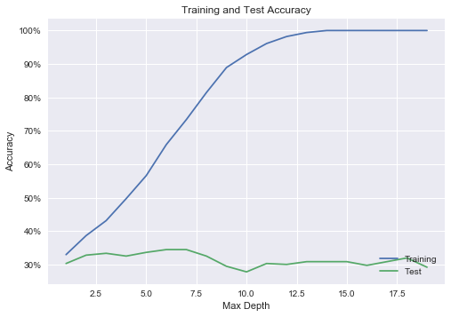
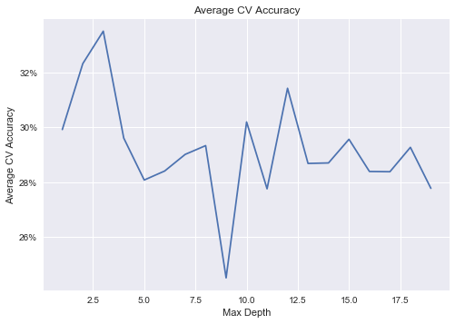
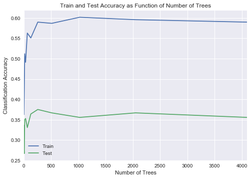

## Contents
{:.no_toc}
*  
{: toc}


```python
import numpy as np
import pandas as pd
import matplotlib
import matplotlib.pyplot as plt
import datetime
from datetime import date
from sklearn.metrics import r2_score
import statsmodels.api as sm
from statsmodels.api import OLS
from sklearn.linear_model import Ridge
from sklearn.linear_model import Lasso
from sklearn.linear_model import RidgeCV
from sklearn.linear_model import LassoCV
from sklearn.linear_model import LogisticRegressionCV
from sklearn.linear_model import LogisticRegression
import sklearn.metrics as metrics
from sklearn.preprocessing import PolynomialFeatures
from sklearn.discriminant_analysis import LinearDiscriminantAnalysis
from sklearn.discriminant_analysis import QuadraticDiscriminantAnalysis
from sklearn.neighbors import KNeighborsClassifier
from sklearn.neighbors import KNeighborsRegressor
from sklearn.tree import DecisionTreeClassifier
from sklearn.model_selection import cross_val_score
from sklearn.tree import export_graphviz
from IPython.display import Image
from IPython.display import display
from matplotlib.ticker import FuncFormatter
import sklearn.tree as tree
import collections
%matplotlib inline
```


    /Applications/anaconda/lib/python3.6/site-packages/statsmodels/compat/pandas.py:56: FutureWarning: The pandas.core.datetools module is deprecated and will be removed in a future version. Please use the pandas.tseries module instead.
      from pandas.core import datetools


```python
import pickle
import seaborn as sns
plt.style.use('seaborn')
with open('aggregate_data.p', 'rb') as f:
    data = pickle.load(f)
    data = pd.DataFrame(data)

#impute missings with mean
#cols_with_missing = pd.isnull(x_train_cons).sum(axis=0)
#print(cols_with_missing)
category_means = data.groupby('category').mean()

tmp = data.join(category_means, rsuffix = '_category_mean', on = 'category')
means = tmp[[x+'_category_mean' for x in data.columns if x not in ['category', 'featured','num_tracks','num_followers']]]
means.columns = [x.split('_category_mean')[0] for x in means.columns]
data = data.fillna(means)
data = data.fillna(data.mean())


#drop vars that make no sense

columns = ['acousticness_max', 'acousticness_mean', 'acousticness_median', 'acousticness_min', 'acousticness_sd', 
'category', 'danceability_max', 'danceability_mean', 'danceability_median', 'danceability_min', 
'danceability_sd', 'duration_ms_max', 'duration_ms_mean', 'duration_ms_median', 'duration_ms_min', 
'duration_ms_sd', 'energy_max', 'energy_mean', 'energy_median', 'energy_min', 'energy_sd', 'featured',
'instrumentalness_max', 'instrumentalness_mean', 'instrumentalness_median', 'instrumentalness_min', 
'instrumentalness_sd', 'key_mode', 'liveness_max', 'liveness_mean', 'liveness_median', 'liveness_min', 
'liveness_sd', 'loudness_max', 'loudness_mean', 'loudness_median', 'loudness_min', 'loudness_sd', 
'mode_mean', 'mode_median', 'mode_mode', 'available_markets_max', 'available_markets_mean', 
           'available_markets_median', 'available_markets_min', 'available_markets_sd', 'popularity_max', 
'popularity_mean', 'popularity_median', 'popularity_min', 'popularity_sd', 'speechiness_max', 
'speechiness_mean', 'speechiness_median', 'speechiness_min', 'speechiness_sd', 'tempo_max', 'tempo_mean', 
'tempo_median', 'tempo_min', 'tempo_sd', 'time_signature_mode', 'valence_max', 'valence_mean', 
'valence_median', 'valence_min', 'valence_sd', 'artist_famil_max', 'artist_famil_mean', 
'artist_famil_median', 'artist_famil_min', 'artist_famil_sd', 'artist_hot_max', 
'artist_hot_mean', 'artist_hot_median', 'artist_hot_min', 'artist_hot_sd', 
'song_hot_max', 'song_hot_mean', 'song_hot_median', 'song_hot_min', 
'song_hot_sd', 'num_followers'
          , 'num_tracks'
          ]

not_overlap = [x for x in columns if x not in data.columns]


data = data[columns]


def create_categorical_vars(data):
    categorical = ['category']
    dummies = {}
    for var in categorical:
        dummies[var] = pd.get_dummies(data[var], prefix = var)
        cols_to_keep = dummies[var].columns[0:len(dummies[var].columns)-1]
        data = data.join(dummies[var][cols_to_keep])
        data = data.drop(var, 1)
    return data

data = create_categorical_vars(data)


#split into train / test to avoid cheating
np.random.seed(1234)
train_pct = .5
msk = np.random.uniform(0,1,len(data)) < train_pct
train = data.loc[msk, :]
test = data.loc[~msk, :]
```


```python
train.head()
```


<div>
<style>
    .dataframe thead tr:only-child th {
        text-align: right;
    }

    .dataframe thead th {
        text-align: left;
    }

    .dataframe tbody tr th {
        vertical-align: top;
    }
</style>
<table border="1" class="dataframe">
  <thead>
    <tr style="text-align: right;">
      <th></th>
      <th>acousticness_max</th>
      <th>acousticness_mean</th>
      <th>acousticness_median</th>
      <th>acousticness_min</th>
      <th>acousticness_sd</th>
      <th>danceability_max</th>
      <th>danceability_mean</th>
      <th>danceability_median</th>
      <th>danceability_min</th>
      <th>danceability_sd</th>
      <th>...</th>
      <th>category_pop</th>
      <th>category_popculture</th>
      <th>category_punk</th>
      <th>category_reggae</th>
      <th>category_rock</th>
      <th>category_romance</th>
      <th>category_sleep</th>
      <th>category_soul</th>
      <th>category_toplists</th>
      <th>category_travel</th>
    </tr>
  </thead>
  <tbody>
    <tr>
      <th>37i9dQZF1DWSBRKlyNxSuy</th>
      <td>0.985</td>
      <td>0.904500</td>
      <td>0.9440</td>
      <td>0.623000</td>
      <td>0.083575</td>
      <td>0.540</td>
      <td>0.442917</td>
      <td>0.4635</td>
      <td>0.2890</td>
      <td>0.065845</td>
      <td>...</td>
      <td>0</td>
      <td>0</td>
      <td>0</td>
      <td>0</td>
      <td>0</td>
      <td>0</td>
      <td>0</td>
      <td>0</td>
      <td>0</td>
      <td>0</td>
    </tr>
    <tr>
      <th>37i9dQZF1DWSIcimvN18p3</th>
      <td>0.994</td>
      <td>0.649742</td>
      <td>0.7090</td>
      <td>0.013200</td>
      <td>0.277198</td>
      <td>0.813</td>
      <td>0.537625</td>
      <td>0.5260</td>
      <td>0.2190</td>
      <td>0.133520</td>
      <td>...</td>
      <td>0</td>
      <td>0</td>
      <td>0</td>
      <td>0</td>
      <td>0</td>
      <td>0</td>
      <td>0</td>
      <td>0</td>
      <td>0</td>
      <td>0</td>
    </tr>
    <tr>
      <th>37i9dQZF1DWSNNoRF9meHq</th>
      <td>0.989</td>
      <td>0.916120</td>
      <td>0.9340</td>
      <td>0.643000</td>
      <td>0.069801</td>
      <td>0.237</td>
      <td>0.117402</td>
      <td>0.1115</td>
      <td>0.0611</td>
      <td>0.042378</td>
      <td>...</td>
      <td>0</td>
      <td>0</td>
      <td>0</td>
      <td>0</td>
      <td>0</td>
      <td>0</td>
      <td>0</td>
      <td>0</td>
      <td>0</td>
      <td>0</td>
    </tr>
    <tr>
      <th>37i9dQZF1DWSNmwgf7Nv11</th>
      <td>0.979</td>
      <td>0.490855</td>
      <td>0.4705</td>
      <td>0.000552</td>
      <td>0.306968</td>
      <td>0.831</td>
      <td>0.527132</td>
      <td>0.5335</td>
      <td>0.1990</td>
      <td>0.138828</td>
      <td>...</td>
      <td>0</td>
      <td>0</td>
      <td>0</td>
      <td>0</td>
      <td>0</td>
      <td>0</td>
      <td>0</td>
      <td>0</td>
      <td>0</td>
      <td>0</td>
    </tr>
    <tr>
      <th>37i9dQZF1DWSRoT7QRAibZ</th>
      <td>0.937</td>
      <td>0.736114</td>
      <td>0.8045</td>
      <td>0.055500</td>
      <td>0.207173</td>
      <td>0.897</td>
      <td>0.560451</td>
      <td>0.5460</td>
      <td>0.3380</td>
      <td>0.119142</td>
      <td>...</td>
      <td>0</td>
      <td>0</td>
      <td>0</td>
      <td>0</td>
      <td>0</td>
      <td>0</td>
      <td>0</td>
      <td>0</td>
      <td>0</td>
      <td>0</td>
    </tr>
  </tbody>
</table>
<p>5 rows × 115 columns</p>
</div>


```python
test.head()
```


<div>
<style>
    .dataframe thead tr:only-child th {
        text-align: right;
    }

    .dataframe thead th {
        text-align: left;
    }

    .dataframe tbody tr th {
        vertical-align: top;
    }
</style>
<table border="1" class="dataframe">
  <thead>
    <tr style="text-align: right;">
      <th></th>
      <th>acousticness_max</th>
      <th>acousticness_mean</th>
      <th>acousticness_median</th>
      <th>acousticness_min</th>
      <th>acousticness_sd</th>
      <th>danceability_max</th>
      <th>danceability_mean</th>
      <th>danceability_median</th>
      <th>danceability_min</th>
      <th>danceability_sd</th>
      <th>...</th>
      <th>category_pop</th>
      <th>category_popculture</th>
      <th>category_punk</th>
      <th>category_reggae</th>
      <th>category_rock</th>
      <th>category_romance</th>
      <th>category_sleep</th>
      <th>category_soul</th>
      <th>category_toplists</th>
      <th>category_travel</th>
    </tr>
  </thead>
  <tbody>
    <tr>
      <th>37i9dQZF1DWSDoVybeQisg</th>
      <td>0.882</td>
      <td>0.261093</td>
      <td>0.20100</td>
      <td>0.000242</td>
      <td>0.235758</td>
      <td>0.684</td>
      <td>0.393732</td>
      <td>0.3980</td>
      <td>0.156</td>
      <td>0.122645</td>
      <td>...</td>
      <td>0</td>
      <td>0</td>
      <td>0</td>
      <td>0</td>
      <td>1</td>
      <td>0</td>
      <td>0</td>
      <td>0</td>
      <td>0</td>
      <td>0</td>
    </tr>
    <tr>
      <th>37i9dQZF1DWSJHnPb1f0X3</th>
      <td>0.491</td>
      <td>0.093987</td>
      <td>0.05495</td>
      <td>0.001760</td>
      <td>0.112922</td>
      <td>0.836</td>
      <td>0.684959</td>
      <td>0.6870</td>
      <td>0.409</td>
      <td>0.086818</td>
      <td>...</td>
      <td>0</td>
      <td>0</td>
      <td>0</td>
      <td>0</td>
      <td>0</td>
      <td>0</td>
      <td>0</td>
      <td>0</td>
      <td>0</td>
      <td>0</td>
    </tr>
    <tr>
      <th>37i9dQZF1DWSKpvyAAcaNZ</th>
      <td>0.955</td>
      <td>0.174686</td>
      <td>0.06580</td>
      <td>0.000009</td>
      <td>0.238388</td>
      <td>0.806</td>
      <td>0.506744</td>
      <td>0.5350</td>
      <td>0.246</td>
      <td>0.138378</td>
      <td>...</td>
      <td>0</td>
      <td>0</td>
      <td>0</td>
      <td>0</td>
      <td>0</td>
      <td>0</td>
      <td>0</td>
      <td>0</td>
      <td>0</td>
      <td>0</td>
    </tr>
    <tr>
      <th>37i9dQZF1DWSOkubnsDCSS</th>
      <td>0.671</td>
      <td>0.188856</td>
      <td>0.14150</td>
      <td>0.001700</td>
      <td>0.162775</td>
      <td>0.895</td>
      <td>0.690434</td>
      <td>0.7015</td>
      <td>0.417</td>
      <td>0.134916</td>
      <td>...</td>
      <td>0</td>
      <td>0</td>
      <td>0</td>
      <td>0</td>
      <td>0</td>
      <td>0</td>
      <td>0</td>
      <td>0</td>
      <td>0</td>
      <td>0</td>
    </tr>
    <tr>
      <th>37i9dQZF1DWSPfT00faDTn</th>
      <td>0.983</td>
      <td>0.611544</td>
      <td>0.67700</td>
      <td>0.001300</td>
      <td>0.285523</td>
      <td>0.939</td>
      <td>0.570000</td>
      <td>0.5610</td>
      <td>0.196</td>
      <td>0.152046</td>
      <td>...</td>
      <td>0</td>
      <td>0</td>
      <td>0</td>
      <td>0</td>
      <td>0</td>
      <td>0</td>
      <td>0</td>
      <td>0</td>
      <td>0</td>
      <td>0</td>
    </tr>
  </tbody>
</table>
<p>5 rows × 115 columns</p>
</div>


```python
to_y_train = np.log(train['num_followers'].astype(float))
to_y_test = np.log(test['num_followers'].astype(float))
to_x_train = train[[x for x in train.columns if x != 'num_followers']]
to_x_test = test[[x for x in test.columns if x != 'num_followers']]
```


```python
#Standardize
#train_means_and_sds = {}
continuous_variables = [x for x in to_x_train.columns if 'category' not in x and x != 'available_markets_max' and x != 'featured']
non_continuous_variables = [x for x in to_x_train.columns if 'category' in x]

def standardize_data(data, train):
        return (data - train.mean()) / train.std()


x_train_cont = standardize_data(to_x_train[continuous_variables], to_x_train[continuous_variables])
x_test_cont = standardize_data(to_x_test[continuous_variables], to_x_train[continuous_variables])

x_train_std = x_train_cont.join(to_x_train[non_continuous_variables])
x_test_std = x_test_cont.join(to_x_test[non_continuous_variables])

x_train_std2 = x_train_std.join(to_x_train['available_markets_max'])
x_test_std2 = x_test_std.join(to_x_test['available_markets_max'])

x_train_std3 = x_train_std2.join(to_x_train['featured'])
x_test_std3 = x_test_std2.join(to_x_test['featured'])


y_train = standardize_data(to_y_train, to_y_train).astype(float)
y_test = standardize_data(to_y_test, to_y_train).astype(float)
```


```python
x_train_const = sm.tools.add_constant(x_train_std3, has_constant = 'add')
x_test_const = sm.tools.add_constant(x_test_std3, has_constant = 'add')
```


```python
#Let's think more about which vars to include
to_drop = ['acousticness_max',  'acousticness_median', 'acousticness_min', 'danceability_max',  'danceability_median', 'danceability_min', 
'duration_ms_max',  'duration_ms_median', 'duration_ms_min', 'energy_max', 'energy_median', 'energy_min', 
'instrumentalness_max', 'instrumentalness_median', 'instrumentalness_min', 'liveness_max',  'liveness_median', 
'liveness_min', 'loudness_max', 'loudness_median', 'loudness_min','mode_mean', 'mode_median', 
'available_markets_max','available_markets_median', 'available_markets_min', 'popularity_median', 
'popularity_min', 'speechiness_max', 'speechiness_median', 'speechiness_min', 'tempo_max','tempo_median', 
'tempo_min', 'time_signature_mode', 'valence_max', 'valence_median', 'valence_min', 'artist_famil_max', 
'artist_famil_median', 'artist_famil_min', 'artist_hot_max', 
 'artist_hot_median', 'artist_hot_min', 
'song_hot_max', 'song_hot_median', 'song_hot_min']

x_train = x_train_const.drop(to_drop, axis=1)
x_test = x_test_const.drop(to_drop, axis=1)

```


```python
regression = OLS(y_train, x_train).fit()
ols_train_preds = regression.predict(x_train)
ols_test_preds = regression.predict(x_test)
print('Train R^2: {rsq}'.format(rsq = regression.rsquared))
print('Train BIC: {bic}'.format(bic = regression.bic))
print('Test R^2: ', r2_score(y_test, ols_test_preds))
#regression.summary()
```


    Train R^2: 0.5621439417922931
    Train BIC: 1066.1680987155785
    Test R^2:  0.303403795346


```python
#LASSO
lasso_model = LassoCV(alphas = [10**i for i in (-5,-4,-3,-2,-1,0,1,2,3,4,5)], fit_intercept = False, tol = 0.01)
lasso_fitted = lasso_model.fit(x_train, y_train)
print("Train R2", lasso_fitted.score(x_train, y_train))
print("Test R2", lasso_fitted.score(x_test, y_test))
pd.Series(lasso_model.coef_, index = x_train.columns)
```


    Train R2 0.491569481115
    Test R2 0.325515614121


    const                      0.087827
    acousticness_mean          0.000000
    acousticness_sd            0.078522
    danceability_mean          0.015949
    danceability_sd           -0.025545
    duration_ms_mean           0.016489
    duration_ms_sd             0.004517
    energy_mean                0.000000
    energy_sd                 -0.063053
    instrumentalness_mean      0.015758
    instrumentalness_sd        0.063147
    key_mode                  -0.000000
    liveness_mean              0.002489
    liveness_sd                0.000000
    loudness_mean             -0.000000
    loudness_sd                0.000000
    mode_mode                 -0.055253
    available_markets_mean    -0.048225
    available_markets_sd       0.160470
    popularity_max            -0.096544
    popularity_mean            0.679687
    popularity_sd              0.022512
    speechiness_mean           0.012941
    speechiness_sd            -0.000000
    tempo_mean                 0.035863
    tempo_sd                  -0.000000
    valence_mean              -0.004493
    valence_sd                -0.019445
    artist_famil_mean          0.000000
    artist_famil_sd            0.003870
                                 ...   
    category_classical        -0.251419
    category_comedy            0.000000
    category_country           0.000000
    category_decades           0.000000
    category_dinner           -0.000000
    category_edm_dance         0.137330
    category_focus             0.000000
    category_folk_americana    0.223266
    category_funk              0.000000
    category_gaming           -0.847952
    category_hiphop           -0.000000
    category_holidays         -0.000000
    category_indie_alt         0.000000
    category_jazz             -0.000000
    category_kids              0.000000
    category_latin            -0.273327
    category_metal             0.000000
    category_mood              0.104723
    category_party            -0.000000
    category_pop              -0.000000
    category_popculture       -1.060791
    category_punk              0.000000
    category_reggae            0.000000
    category_rock             -0.000000
    category_romance          -0.000000
    category_sleep             0.000000
    category_soul              0.000000
    category_toplists          0.000000
    category_travel           -0.006069
    featured                   0.257711
    Length: 68, dtype: float64


```python
#Ridge
ridge_model = RidgeCV(alphas = [10**i for i in (-5,-4,-3,-2,-1,0,1,2,3,4,5)], fit_intercept = False)
ridge_fitted = ridge_model.fit(x_train, y_train)
print("Train R2", ridge_fitted.score(x_train, y_train))
print("Test R2", ridge_fitted.score(x_test, y_test))
pd.Series(ridge_model.coef_, index = x_train.columns)
```


    Train R2 0.558018998229
    Test R2 0.31182299033


    const                      0.034160
    acousticness_mean          0.130132
    acousticness_sd            0.222815
    danceability_mean          0.103260
    danceability_sd           -0.026571
    duration_ms_mean           0.099280
    duration_ms_sd            -0.015643
    energy_mean                0.165377
    energy_sd                 -0.179710
    instrumentalness_mean      0.023256
    instrumentalness_sd        0.095248
    key_mode                  -0.023768
    liveness_mean              0.039376
    liveness_sd               -0.004025
    loudness_mean             -0.197089
    loudness_sd               -0.007543
    mode_mode                 -0.049869
    available_markets_mean    -0.051055
    available_markets_sd       0.155659
    popularity_max            -0.180769
    popularity_mean            0.848093
    popularity_sd              0.090733
    speechiness_mean           0.017621
    speechiness_sd            -0.013415
    tempo_mean                 0.160158
    tempo_sd                   0.054726
    valence_mean              -0.081561
    valence_sd                 0.011685
    artist_famil_mean          0.084133
    artist_famil_sd            0.000529
                                 ...   
    category_classical        -0.300859
    category_comedy           -0.031089
    category_country           0.110161
    category_decades           0.057256
    category_dinner           -0.138004
    category_edm_dance         0.432203
    category_focus             0.197655
    category_folk_americana    0.545537
    category_funk              0.302124
    category_gaming           -1.081773
    category_hiphop           -0.110136
    category_holidays         -0.154503
    category_indie_alt         0.185002
    category_jazz              0.028355
    category_kids              0.302787
    category_latin            -0.408385
    category_metal             0.229485
    category_mood              0.284824
    category_party            -0.154922
    category_pop              -0.044182
    category_popculture       -1.268640
    category_punk              0.249540
    category_reggae            0.699517
    category_rock              0.006735
    category_romance          -0.135746
    category_sleep            -0.064270
    category_soul              0.362327
    category_toplists          0.145192
    category_travel           -0.227949
    featured                   0.742492
    Length: 68, dtype: float64


```python
#CLASSIFICATION MODELS!!


#Let's split our dependent var into quartiles
data['num_followers_quantile'] = pd.qcut(data['num_followers'], 5, labels=False)
quantiles = data['num_followers_quantile']
```


```python
x_train_class = x_train
x_test_class = x_test
y_train_class = pd.concat([y_train, quantiles], axis=1, join_axes=[y_train.index]).drop('num_followers', axis = 1).values.ravel()
y_test_class = pd.concat([y_test, quantiles], axis=1, join_axes=[y_test.index]).drop('num_followers', axis = 1).values.ravel()
```


```python
def calculate_cr(classifications, y):
    correct = classifications == y
    cr = correct.sum()/len(correct)
    return cr
```


```python
#Multinomial Logistic
logistic_regression_mn = LogisticRegressionCV(Cs=10, multi_class='multinomial').fit(x_train_class, y_train_class)
logistic_classifications_train_mn = logistic_regression_mn.predict(x_train_class)
logistic_classifications_test_mn = logistic_regression_mn.predict(x_test_class)
#print(logistic_classifications_train_mn.shape)
#print(y_train_class)
print("Multinomial Logistic Regression")
print("\tTrain CR:", str(calculate_cr(logistic_classifications_train_mn, y_train_class)))
print("\tTest CR:", str(calculate_cr(logistic_classifications_test_mn, y_test_class)))

#OvR Logistic Reg
logistic_regression_ovr = LogisticRegressionCV(Cs=10, multi_class='ovr').fit(x_train_class, y_train_class)
logistic_classifications_train_ovr = logistic_regression_ovr.predict(x_train_class)
logistic_classifications_test_ovr = logistic_regression_ovr.predict(x_test_class)

print("OvR Logistic Regression")
print("\tTrain CR:", str(calculate_cr(logistic_classifications_train_ovr, y_train_class)))
print("\tTest CR:", str(calculate_cr(logistic_classifications_test_ovr, y_test_class)))

```


    Multinomial Logistic Regression
    	Train CR: 0.52994011976
    	Test CR: 0.338888888889
    OvR Logistic Regression
    	Train CR: 0.505988023952
    	Test CR: 0.355555555556


```python
#LDA
lda = LinearDiscriminantAnalysis().fit(x_train_class, y_train_class)
lda_classifications_train = lda.predict(x_train_class)
lda_classifications_test = lda.predict(x_test_class)

print("LDA")
print("\tTrain CR:", str(calculate_cr(lda_classifications_train, y_train_class)))
print("\tTest CR:", str(calculate_cr(lda_classifications_test, y_test_class)))


#QDA
qda = QuadraticDiscriminantAnalysis().fit(x_train_class, y_train_class);
qda_classifications_train = qda.predict(x_train_class)
qda_classifications_test = qda.predict(x_test_class)


print("QDA")
print("\tTrain CR:", str(calculate_cr(qda_classifications_train, y_train_class)))
print("\tTest CR:", str(calculate_cr(qda_classifications_test, y_test_class)))
```


    LDA
    	Train CR: 0.655688622754
    	Test CR: 0.355555555556
    QDA
    	Train CR: 0.586826347305
    	Test CR: 0.244444444444


    /Applications/anaconda/lib/python3.6/site-packages/sklearn/discriminant_analysis.py:387: UserWarning: Variables are collinear.
      warnings.warn("Variables are collinear.")
    /Applications/anaconda/lib/python3.6/site-packages/sklearn/discriminant_analysis.py:695: UserWarning: Variables are collinear
      warnings.warn("Variables are collinear")


```python
#Decision Trees
from sklearn.tree import DecisionTreeClassifier, DecisionTreeClassifier
from matplotlib.ticker import FuncFormatter
from sklearn.model_selection import cross_val_score
import sklearn.tree as tree
import collections

depth = range(1,20)
train_accuracy = []
test_accuracy = []
for i in depth:
    classifier = DecisionTreeClassifier(max_depth = i)
    classifier.fit(x_train_class, y_train_class)
    classifications_train = classifier.predict(x_train_class)
    classifications_test = classifier.predict(x_test_class)
    train_accuracy.append(calculate_cr(classifications_train, y_train_class))
    test_accuracy.append(calculate_cr(classifications_test, y_test_class))
    
fig = plt.figure()
ax = fig.add_subplot(1,1,1)
plt.plot(depth, train_accuracy)
plt.plot(depth, test_accuracy)
plt.title('Training and Test Accuracy')
plt.xlabel('Max Depth')
plt.ylabel('Accuracy')
plt.legend(['Training', 'Test'], loc = 'lower right')
ax.yaxis.set_major_formatter(FuncFormatter(lambda y, _: '{:.0%}'.format(y)))

avg_cv_scores = []
for i in depth:
    classifier = DecisionTreeClassifier(max_depth = i)
    cv_scores = cross_val_score(classifier, x_train_class, y_train_class, cv=5)
    avg_cv_scores.append(np.mean(cv_scores))
avg_cv_scores = np.array(avg_cv_scores)

fig = plt.figure()
ax = fig.add_subplot(1,1,1)
plt.plot(depth, avg_cv_scores)
plt.title('Average CV Accuracy')
plt.xlabel('Max Depth')
plt.ylabel('Average CV Accuracy')
ax.yaxis.set_major_formatter(FuncFormatter(lambda y, _: '{:.0%}'.format(y)))
print('CV Choice of Max Depth: ' + str(avg_cv_scores.argmax()+1))
#print("Max Depth = 2")
print("\tTrain CR:", str(train_accuracy[avg_cv_scores.argmax()]))
print("\tTest CR:", str(test_accuracy[avg_cv_scores.argmax()]))


```


    CV Choice of Max Depth: 3
    	Train CR: 0.431137724551
    	Test CR: 0.333333333333








```python
from sklearn.tree import DecisionTreeClassifier
from sklearn.ensemble import RandomForestClassifier
from sklearn.ensemble import AdaBoostClassifier
num_trees = [2**i for i in [1,2,3,4,5,6,7,8, 9, 10, 11, 12]]
train_accs = {}
test_accs = {}
for i in num_trees:
    clf = RandomForestClassifier(n_estimators = i, max_features = 'sqrt', max_depth = 2)
    clf = clf.fit(x_train_class, y_train_class)
    train_preds = clf.predict(x_train_class)
    test_preds = clf.predict(x_test_class)
    train_accs[i] = clf.score(x_train_class, y_train_class)
    test_accs[i] = clf.score(x_test_class, y_test_class)
accs = pd.DataFrame({'Train': train_accs, 'Test' : test_accs})[['Train', 'Test']]
accs.plot(title = 'Train and Test Accuracy as Function of Number of Trees')
plt.xlabel('Number of Trees')
plt.ylabel('Classification Accuracy')
print(accs)
```


             Train      Test
    2     0.362275  0.336111
    4     0.383234  0.277778
    8     0.422156  0.266667
    16    0.511976  0.350000
    32    0.491018  0.352778
    64    0.562874  0.330556
    128   0.550898  0.363889
    256   0.589820  0.375000
    512   0.586826  0.366667
    1024  0.601796  0.355556
    2048  0.595808  0.366667
    4096  0.589820  0.355556





```python
learning_rate = .05
max_depths = [1,2,5, 10, None]
num_trees = [2 ** i for i in [1,2,3,4,5,6,7,8,9, 10]]

def adaboost(max_depth, num_tree):
    base_clf = DecisionTreeClassifier(max_depth = max_depth)
    clf = AdaBoostClassifier(base_clf, n_estimators = num_tree, learning_rate=learning_rate)
    return clf

#Run model on train and test - fix trees at 64
acc_train = {}
acc_test = {}
for max_depth in max_depths:
    clf = adaboost(max_depth, 64)
    clf = clf.fit(x_train_class, y_train_class)
    acc_train[max_depth] = clf.score(x_train_class, y_train_class)
    acc_test[max_depth] = clf.score(x_test_class, y_test_class)
accs_by_max_depth = pd.DataFrame({'Train' : acc_train, 'Test': acc_test})[['Train', 'Test']]


#Run model on train and test - fix max_depth at 2
acc_train = {}
acc_test = {}
for num_tree in num_trees:
    clf = adaboost(2, num_tree)
    clf = clf.fit(x_train_class, y_train_class)
    acc_train[num_tree] = clf.score(x_train_class, y_train_class)
    acc_test[num_tree] = clf.score(x_test_class, y_test_class)
accs_by_num_trees = pd.DataFrame({'Train' : acc_train, 'Test': acc_test})[['Train', 'Test']]
    
```


```python

```


```python

```

